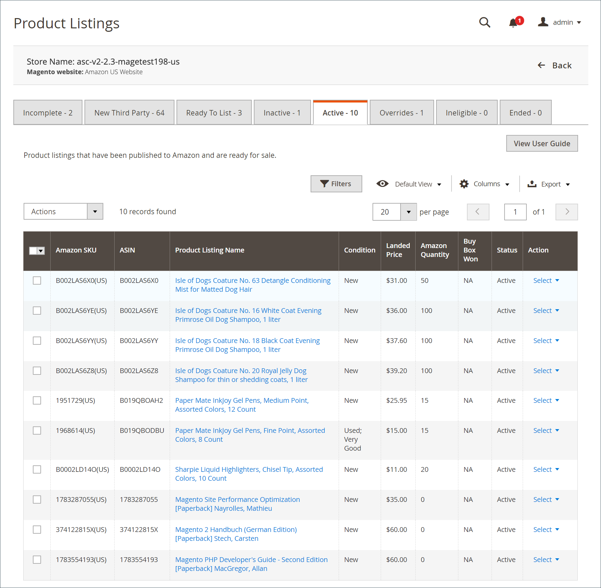

# Listagens ativas do Amazon

A variável _[!UICONTROL Active]_mostra as listagens ativas no [!DNL Amazon Marketplace] que corresponderam a um produto no seu [!DNL Commerce] catálogo.

As ações disponíveis no _[!UICONTROL Active]_incluem:

Em _[!UICONTROL Actions]_:

- **[!UICONTROL End Listing(s) on Amazon]**: selecione para remover todas as listagens selecionadas da [!DNL Amazon Marketplace]. Consulte [Encerrar uma listagem do Amazon](./end-listings-manually.md).

- **[!UICONTROL Edit Listing Overrides]**: Opte por alterar as definições de substituição da lista. Consulte [Substituições](./overrides.md) ou [Editar ou remover uma sobreposição](./creating-editing-overrides.md#edit-override-single-listing).

Em **[!UICONTROL Select]** no _[!UICONTROL Action]_coluna:

- **[!UICONTROL View Details]**: Opte por exibir os detalhes da listagem, incluindo o [Log de atividades de listagem](./product-listing-details.md#listing-activity-log), [Preços do Concorrente Buy Box](./product-listing-details.md#buy-box-competitor-pricing), e [Menor preço para concorrentes](./product-listing-details.md#lowest-competitor-pricing). Esta ação é somente para exibição. Nenhuma alteração pode ser feita nos detalhes da lista. Consulte [Exibir detalhes](./product-listing-details.md).

- **[!UICONTROL Create Override]**: escolha criar uma sobreposição e aplicá-la a esta lista. Consulte [Criar uma substituição](./creating-editing-overrides.md).

- **[!UICONTROL Edit Assigned ASIN]**: escolha modificar a ASIN atribuída ao produto de catálogo. Use esta ação se um produto no catálogo corresponder ao ASIN incorreto. Consulte [Editar uma ASIN atribuída](./edit-assigned-asin.md).

- **[!UICONTROL Create Alias Seller SKU]**: escolha criar um SKU de alias que possa ser usado para criar uma lista do Amazon do mesmo produto de catálogo. Consulte [Criar um SKU de Vendedor Alias](./create-alias-seller-sku.md).

- **[!UICONTROL Switch to Fulfilled by Amazon/Merchant]**: Opte por alterar o método de preenchimento associado à ordem. Consulte [Definir configurações de Preenchido por](./fulfilled-by.md#configure-fulfilled-by-settings).

- **[!UICONTROL End Listing]**: selecione para remover a lista da lista [!DNL Amazon Marketplace]. Consulte [Encerrar uma listagem do Amazon](./end-listings-manually.md).

>[!NOTE]
>
>Se você tiver listagens em andamento, o número de listagens será exibido em uma mensagem acima das guias.

{width="700" zoomable="yes"}

As home pages dos canais de vendas do Amazon compartilham algumas informações [controles do espaço de trabalho](./workspace-controls.md) que permitem personalizar os dados exibidos.

| Coluna | Descrição |
|-----------------------------------|-------------------------------------------------------------------------------------------------------------------------------------------------------------------------------------------------------------------------------------------------------------------------------------------------------------------------------------------------------------------------------------------------------------------------------------------------------------------------------------------------------------------------------------------------------------------------------------------------------------------------------------------------------------------------------------|
| [!UICONTROL Amazon Seller SKU] | A SKU (Unidade de manutenção de estoque) atribuída pela Amazon a um produto para identificar o produto, as opções, o preço e o fabricante. |
| [!UICONTROL ASIN] | Um bloco exclusivo de 10 letras e/ou números que identificam itens.   ASIN significa [!DNL Amazon Standard Identification Number]. Um ASIN é um bloco exclusivo de 10 letras e/ou números que identificam itens. Para livros, o ASIN é o mesmo que o número ISBN, mas para todos os outros produtos, um novo ASIN é criado quando o item é carregado para o seu catálogo. Você pode encontrar um ASIN de itens na página de detalhes do produto no Amazon, juntamente com mais detalhes relacionados ao item. |
| [!UICONTROL Product Listing Name] | O nome do produto. |
| [!UICONTROL Condition] | A variável [condição](./product-listing-condition.md) do produto. |
| [!UICONTROL Landed Price] | O preço de listagem do produto mais seu preço de envio. |
| [!UICONTROL Amazon Quantity] | A quantidade disponível depois que o produto é listado ativamente no Amazon. |
| [!UICONTROL Status] | O status da lista, definido pelo Amazon. |
| [!UICONTROL Buy Box Won] | Se a lista de produtos ganhou o [Buy Box](./buy-box-competitor-pricing.md) posição. |
| [!UICONTROL Action] | Lista de ações disponíveis que podem ser aplicadas a uma lista específica. Para aplicar uma ação, clique em **[!UICONTROL Select]** no _[!UICONTROL Action]_para mostrar suas opções:<ul><li>[[!UICONTROL View Details]](./product-listing-details.md)</li><li>[[!UICONTROL Create Override]](./creating-editing-overrides.md)</li><li>[[!UICONTROL Edit Assigned ASIN]](./edit-assigned-asin.md)</li><li>[[!UICONTROL Create Alias Seller SKU]](./create-alias-seller-sku.md#region-specific)</li><li>[[!UICONTROL Switch to Fulfilled By Amazon/Merchant]](./fulfilled-by.md#configure-fulfilled-by-settings)</li><li>[[!UICONTROL End Listing]](./end-listings-manually.md)</li></ul> |
