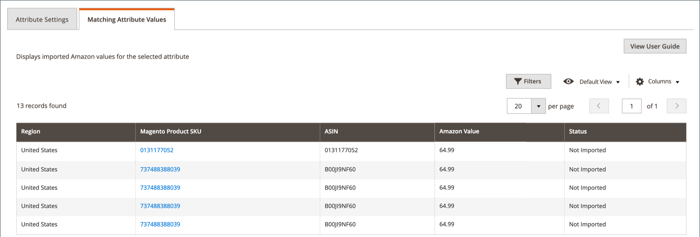

# Exibir mapeamento de atributo do Amazon

Conforme você mapeia atributos do Amazon para [!DNL Commerce] atributos, o canal de vendas do Amazon rastreia e fornece uma lista filtrável de todos os valores do Amazon. Use esta página para verificar os valores dos atributos [!DNL Commerce] vinculados corretamente na sincronização entre [!DNL Commerce] e o Amazon. Você pode revisar os valores sincronizados para o atributo Amazon vinculado ou não a um atributo [!DNL Commerce]. Para criar ou editar atributos do Amazon, consulte [Criação e edição de atributos](./creating-attributes.md).

O _Valor do Amazon_ difere dependendo do tipo de atributo e do atributo do Amazon que você visualiza. Por exemplo, um valor Amazon listado para `Label` seria um valor de texto, enquanto `AmazonListPrice` seria um valor numérico. O status indica se o valor do Amazon foi importado.

## Exibir seus valores de atributo

1. Na barra lateral _[!UICONTROL Admin]_, vá para **[!UICONTROL Marketing]**>_[!UICONTROL Channels]_ > **[!UICONTROL Amazon Sales Channel]**.

1. Clique em **[!UICONTROL Attributes]** no menu à esquerda, localize um atributo Amazon e clique em **[!UICONTROL Create]** ou **[!UICONTROL Edit]** na coluna _[!UICONTROL Action]_.

1. Clique na guia **[!UICONTROL Matching Attribute Values]**.

   As listagens que têm um produto de catálogo [!DNL Commerce] correspondente mostram um valor vinculado na coluna _SKU do produto Magento_. Clicar em um link abre a página de detalhes do produto do catálogo correspondente. As alterações nos atributos do Amazon na página de detalhes do produto não são sincronizadas com o canal de vendas da Amazon.

>[!TIP]
>Para editar ou atribuir o mapeamento para uma listagem a um produto de catálogo, consulte [Atualizar Informações Necessárias](./amazon-manually-update-incomplete-listing.md).

| Campo | Descrição |
|--- |--- |
| [!UICONTROL Region] | A região da atividade de vendas definida em **[!DNL Amazon Marketplace]Country** durante a integração de loja. |
| [!UICONTROL Magento Product SKU] | Indica os [!DNL Commerce] produtos sincronizados com a loja da Amazon. O valor é uma ID de produto atribuída por [!DNL Commerce] e vinculada a um produto no catálogo. Para abrir o produto em [!DNL Commerce], clique no link . |
| [!UICONTROL ASIN] | Indica o identificador único alfanumérico alfanumérico Amazon Standard Identification Number (ASIN) de 10 caracteres atribuído ao produto pela Amazon para identificação do produto. |
| [!UICONTROL Amazon Value] | Indica o valor do atributo selecionado. O Valor do Amazon varia dependendo do tipo de atributo e do atributo do Amazon que você visualiza. Por exemplo, um valor Amazon listado para `Label` seria um valor de texto, enquanto `AmazonListPrice` seria um valor numérico. O status indica se o valor do Amazon foi importado. |
| [!UICONTROL Status] | Indica se os valores do atributo foram importados para [!DNL Commerce] e vinculados a um atributo [!DNL Commerce]. Opções: `Not Imported` / `Imported` |
