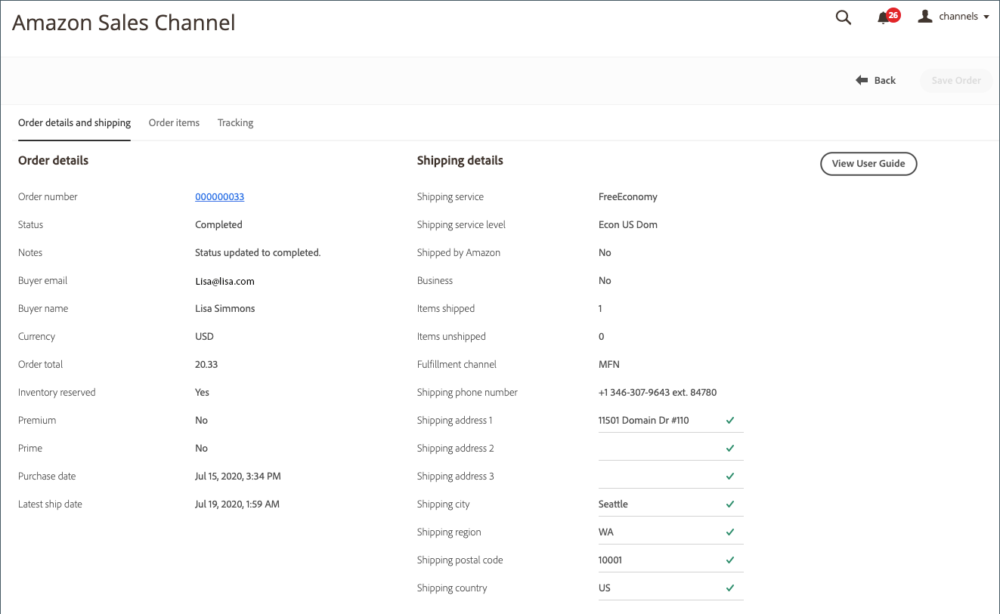

# Detalhes do pedido Amazon

{width="600" zoomable="yes"}

## Exibir detalhes do pedido Amazon

1. Clique em **[!UICONTROL View Store]** no cartão de armazenamento.

1. Na seção _[!UICONTROL Recent Orders]_, clique em um número de pedido.

   A página _[!UICONTROL Amazon Order Details]_é aberta.

>[!NOTE]
>
>Se a importação de pedidos estiver habilitada nas [Configurações do Pedido](./order-settings.md) e o pedido for [preenchido pelo Amazon (FBA)](./fulfilled-by.md), você poderá ver dados fictícios para alguns campos nos detalhes do pedido. A Amazon não envia os dados a seguir para pedidos FBA.
>
> - `AddressType`
> - `AddressLine1`
> - `AddressLine2`
> - `AddressLine3`
> - `BuyerName`
> - `Phone`
> - `PurchaseOrderNumber`
> - `RecipientName`
> - `CustomizedURL`
> - `GiftMessageText`

### Guia Detalhes da Ordem e da Entrega

A guia _[!UICONTROL Order and Shipping Details]_mostra informações detalhadas do pedido, conforme recebidas da Amazon.

>[!IMPORTANT]
>
>O Amazon aceita informações de endereço não padrão que não podem ser importadas para o canal de vendas do Amazon, impedindo assim que os códigos de estado/país sejam atualizados corretamente para alguns pedidos. Para corrigir erros de endereço, os seguintes campos são editáveis nos detalhes do pedido:
>
>- `Shipping address 1`
>- `Shipping address 2`
>- `Shipping address 3`
>- `Shipping city`
>- `Shipping region`
>- `Shipping postal code`
>- `Shipping country`
>
>Não se esqueça de clicar em **Salvar Pedido** depois de fazer edições.

{width="600" zoomable="yes"}

### Guia Itens de pedido

A guia _[!UICONTROL Order Items]_mostra todos os itens associados ao pedido do Amazon, conforme recebidos do Amazon.

{width="600" zoomable="yes"}

### Guia Tracking

A guia _[!UICONTROL Tracking]_mostra informações de rastreamento associadas à ordem do Amazon.

{width="600" zoomable="yes"}
