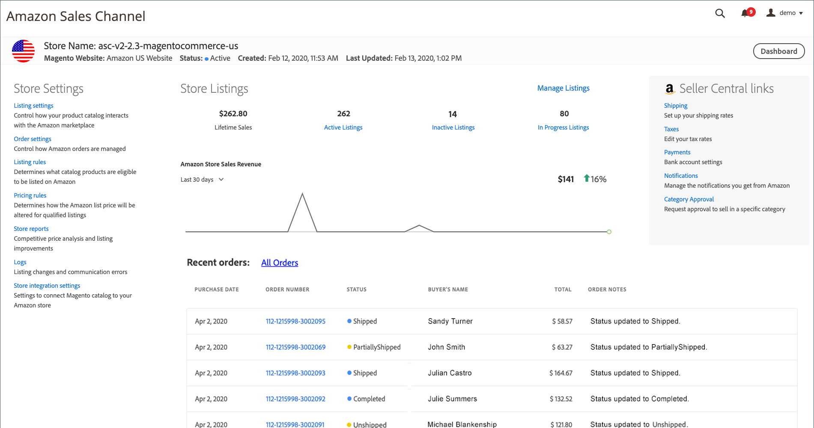

# painel de loja da Amazon

Na exibição _[!UICONTROL Amazon Stores]_da home page do canal de vendas da Amazon, você pode clicar em **[!UICONTROL View Store]**em um cartão da loja para abrir o painel da loja.

O painel da loja é o local principal para exibir a atividade de cada uma das lojas Amazon. Com suas lojas do [!DNL Amazon Seller] adicionadas e integradas, os pedidos e as vendas controlam a visualização de dados da loja. No painel, é possível exibir a receita, rastrear as tendências e revisar os dados de vendas de suas listas. Listas e vendas são agrupadas e rastreadas ainda mais por tipo de lista, incluindo ativa, inativa e em andamento.

Você também pode acessar suas [configurações da loja](./ob-store-review.md), [gerenciar suas listas](./managing-product-listings.md) e exibir dados de vendas e informações recentes sobre pedidos.

{width="600" zoomable="yes"}

O cabeçalho do painel de armazenamento exibe as mesmas informações básicas de armazenamento mostradas no cartão de armazenamento:

- _[!UICONTROL Store Name]_
- _[!UICONTROL Magento Website]_
- _[!UICONTROL Status]_
- _[!UICONTROL Created]_
- _[!UICONTROL Last Updated]_

O painel da loja também inclui dados da loja e links para configurações ou mais informações:

- [**[!UICONTROL Store Settings]**](./ob-store-review.md) - Acesse as configurações e os relatórios do repositório.

   - [**[!UICONTROL Listing settings]**](./listing-settings.md) - Controlar como o catálogo de produtos interage com o [!DNL Amazon Marketplace].

   - [**[!UICONTROL Order settings]**](./order-settings.md) - Controlar como os pedidos da Amazon são gerenciados.

   - [**[!UICONTROL Listing rules]**](./listing-rules.md) - Defina quais produtos de catálogo estão qualificados para serem listados no Amazon.

   - [**[!UICONTROL Pricing rules]**](./pricing-products.md) - Defina como o preço de lista do Amazon é alterado para as listagens qualificadas.

   - [**[!UICONTROL Store reports]**](./amazon-logs-reports.md) - [Análise de preço competitiva](./competitive-price-analysis.md) e [melhorias na listagem](./listing-improvements.md).

   - [**[!UICONTROL Logs]**](./amazon-logs-reports.md) - [Listando alterações](./listing-changes-log.md) e [erros de comunicação](./communication-errors-log.md).

   - [**[!UICONTROL Store integration settings]**](./store-integration-settings.md) - Revise as configurações de email e nome do armazenamento do canal de vendas da Amazon no Administrador [!DNL Commerce].

- **[!UICONTROL Store Listings]** - Mostra uma representação gráfica das vendas da loja nos últimos 7 ou 30 dias, juntamente com os dados de vendas vitalícios.

  Esta seção também mostra as contagens de listagem das suas [listagens ativas](./active-listings.md), [listagens inativas](./inactive-listings.md) e listagens em andamento, além de links para a página _[!UICONTROL Product Listings]_correspondente. Você também pode clicar em **[!UICONTROL Manage Listings]**para abrir a página_[!UICONTROL Product Listings]_. Consulte [Gerenciar Listagens do Amazon](./managing-product-listings.md).

- **[!UICONTROL Recent Orders]** - Mostra informações dos seus pedidos mais recentes da Amazon. As informações listadas se baseiam nas informações recebidas da Amazon. Esta tabela não é atualizada com [!DNL Commerce] informações de pedido, mesmo quando a [importação de pedido](./order-settings.md) está habilitada. Para exibir todos os seus pedidos da Amazon, clique em **Todos os pedidos**.

  Consulte [Exibir Pedidos do Amazon](./amazon-orders-all.md) para obter descrições de colunas e consulte [Gerenciar Pedidos](./managing-orders.md) para obter mais informações.

- **[!UICONTROL Seller Central links]** - Fornece links para informações [!DNL Amazon Seller Central] importantes.
