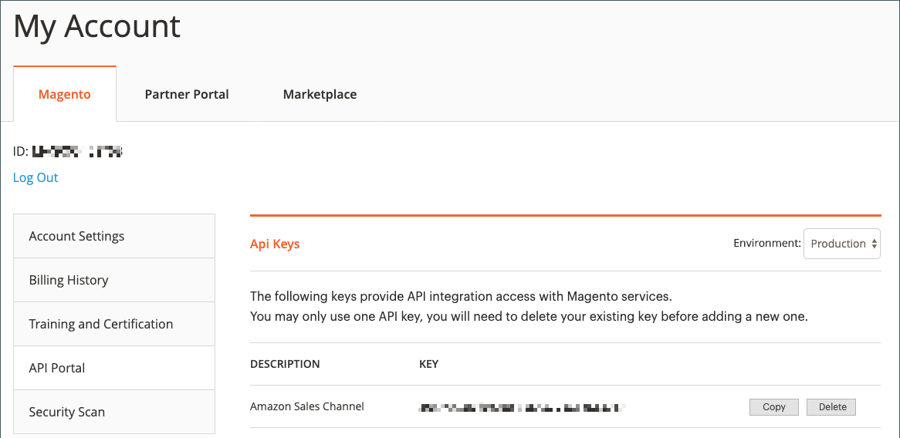

# Adicionar ou verificar a chave de API do Amazon

Ao acessar o canal de vendas do Amazon, [!DNL Commerce] O verifica e valida automaticamente a chave de API do Amazon que você adicionou à configuração da loja. Se for validado, você poderá seguir para a próxima etapa, [Integração da loja](./store-integration.md).

Se a chave de API do Amazon estiver ausente, inválida ou expirada, será necessário atualizar a chave. Será exibida uma mensagem solicitando que você obtenha uma chave de API e adicione-a à configuração do canal de vendas da Amazon.

## Obtenha e adicione a chave de API do Amazon conforme solicitado

A chave de API é validada sempre que você acessa o canal de vendas da Amazon.

1. Faça logon na [!DNL Commerce] Admin.

1. No _[!UICONTROL Admin]_barra lateral, vá para **[!UICONTROL Marketing]**>_[!UICONTROL Channels]_ > **[!UICONTROL Amazon Sales Channel]**.

   Se for a primeira vez que você acessa o canal de vendas da Amazon ou se sua chave de API exigir atualização, o sistema o orientará durante o processo.

   

1. Clique em **[!UICONTROL Sign in]** para acessar o [!DNL Commerce] conta da web.

   A página Contas do Commerce é aberta em uma nova guia do navegador.

   - Se você estiver conectado ao seu [!DNL Commerce] conta, a variável _[!UICONTROL API Portal]_seção do_[!UICONTROL My Account]_ é exibida automaticamente.

   - Se você não estiver conectado, será solicitado a inserir seu [!DNL Commerce] nome de usuário e senha da conta antes de _[!UICONTROL API Portal]_é exibida.

   - Se você não tiver uma conta, visite [o [!DNL Commerce] página da conta](https://account.magento.com/customer/account/login/){target="_blank"} e registrar-se. Essa conta deve fazer parte de sua empresa ou negócio.

1. Se necessário, você pode visualizar e gerar chaves de API no _[!UICONTROL API Portal]_no seu [!DNL Commerce] conta.

   Para criar uma chave de API, insira uma descrição como `Amazon Sales Channel` e clique em **[!UICONTROL Add New]**. A nova chave é gerada e mostrada com o nome inserido. Clique em **[!UICONTROL Copy]** para copiar a nova chave.

   

1. Com a nova chave gerada e copiada, retorne à _[!UICONTROL Amazon Sales Channel]_no navegador.

1. No _[!UICONTROL Welcome to Amazon Sales Channel]_clique em **[!UICONTROL Add the key]**.

   O navegador sai do canal de vendas da Amazon e uma página de configuração da loja abre a _[!UICONTROL Api Keys]_página no [!DNL Commerce] Admin. Você pode abrir esta página manualmente ao acessar **[!UICONTROL Stores]**>_[!UICONTROL Settings]_ > **[!UICONTROL Configuration]**, expandir **[!UICONTROL Services]** no painel esquerdo e escolha **[!UICONTROL Magento Services]**.

1. Cole a chave copiada para **[!UICONTROL Production Api key]**.

1. Clique em **[!UICONTROL Save Config]**. Agora você pode retornar ao canal de vendas da Amazon.

   

1. No _[!UICONTROL Admin]_barra lateral, vá para **[!UICONTROL Marketing]**>_[!UICONTROL Channels]_ > **[!UICONTROL Amazon Sales Channel]**.

   Acessar novamente acionadores do canal de vendas da Amazon [!DNL Commerce] verifique e valide sua chave de API e permite continuar.

   Se for solicitado que você verifique a chave novamente, repita isso _Adicionar e verificar_ processo.

 [**Prosseguir para a integração da loja**](./store-integration.md)
