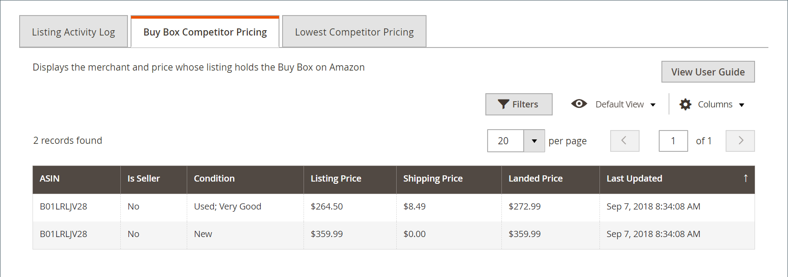

# [!DNL Buy Box] Preços do concorrente

O [!DNL Buy Box] é concedido pela Amazon ao vendedor que tem o produto listado normalmente pelo melhor preço, juntamente com outros fatores, como FBA/Prime Shipping oferecido, disponibilidade e desempenho do vendedor.

A guia _[!UICONTROL Buy Box Competitor Pricing]_na página_[!UICONTROL Product Listing Details]_ inclui o [[!DNL Buy Box]](./buy-box-competitor-pricing.md) listando o preço, o preço de envio e o preço de frete adquirido de seus concorrentes. Use essas informações para entender o posicionamento de preços de seus concorrentes no Amazon.

[É possível configurar ](./intelligent-repricing-rules.md) regras inteligentes de redefinição de preços para ajustá-las com base no  [!DNL Amazon Buy Box] preço.

## Acesse [!DNL Buy Box] Detalhes de preços do concorrente

1. Clique em **[!UICONTROL Manage Listings]** no painel da loja.

   A página [_[!UICONTROL Product Listing]_](./managing-product-listings.md) é aberta.

1. Em qualquer uma das guias de status da lista, clique em um nome de lista de produtos para obter uma lista.

   A página _[!UICONTROL Product Listing Details]_é aberta.

1. Clique na guia **[!UICONTROL Buy Box Competitor Pricing]**.

   Mostra o comerciante e o preço cuja listagem contém [[!DNL Buy Box]](./buy-box-competitor-pricing.md) no Amazon.

| Coluna | Descrição |
|--- |--- |
| [!UICONTROL ASIN] | Um bloco exclusivo de 10 letras e/ou números que identifica itens.  Para livros, o ASIN é o mesmo que o número ISBN, mas para todos os outros produtos, um novo ASIN é criado quando o item é carregado no catálogo. Você pode encontrar o ASIN de um item na página de detalhes do produto, juntamente com detalhes adicionais relacionados ao item (como tamanho, número de páginas ou número de discos). |
| [!UICONTROL Is Seller] | Indica se o vendedor ganhou a posição Buy Box para a listagem. |
| [!UICONTROL Condition] | A [condição](./product-listing-condition.md) do produto. |
| [!UICONTROL Listing Price] | O preço usado para suas listagens do Amazon. |
| [!UICONTROL Shipping Price] | O custo do envio do produto. |
| [!UICONTROL Landed Price] | O preço de listagem do produto mais seu preço de frete. |
| [!UICONTROL Last Updated] | A data em que o preço do Buy Box foi atualizado pela última vez. |
