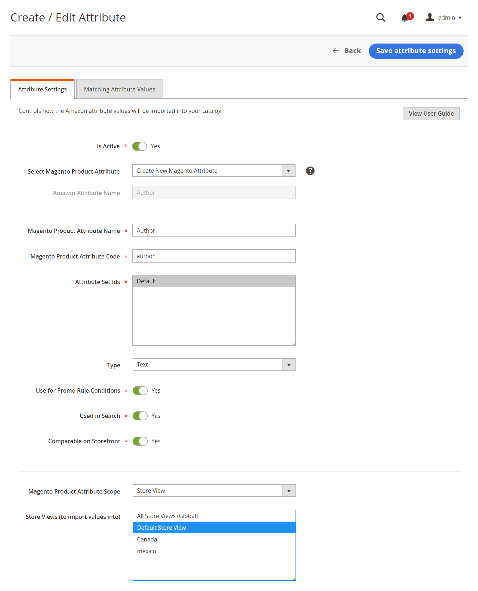

# Criar e editar atributos

Criar ou atualizar [!DNL Commerce] atributos conforme você vende pela Amazon e atualiza suas lojas. Revisar os atributos atuais do Amazon e os [!DNL Commerce] atributos por meio da [_[!UICONTROL Attributes]_exibir](./attributes-view.md) da página inicial do canal de vendas do Amazon. A variável_[!UICONTROL Action]_ mostra as ações disponíveis para o atributo. Você pode criar e mapear um novo [!DNL Commerce] para um atributo do Amazon não vinculado, ou você pode editar um atributo existente [!DNL Commerce] e seu mapeamento para um atributo Amazon.

À medida que você cria e atualiza atributos, talvez você queira verificar os valores de atributo para [!DNL Commerce] e Amazon. Esses valores podem ser diferentes se você não sincronizar e importar valores do Amazon. Para revisar os valores de Amazon para esses atributos, consulte [Revisar o mapeamento de atributos do Amazon](./amazon-matching-attributes-values.md). Se quiser alterar esses valores, você poderá [editar ou criar um mapeamento](./amazon-manually-update-incomplete-listing.md) entre o Amazon e [!DNL Commerce].

## Criar um atributo {#create-an-attribute}

Essas etapas criam uma [!DNL Commerce] e mapeá-lo para um atributo Amazon. Dependendo das configurações, os valores podem começar a sincronizar entre catálogos.

1. No _Admin_ barra lateral, vá para **[!UICONTROL Marketing]** > _[!UICONTROL Channels]_>**[!UICONTROL Amazon Sales Channel]**.

1. Clique em **[!UICONTROL Attributes]** no menu à esquerda, localize um atributo do Amazon e clique em **[!UICONTROL Create Attribute]** no _[!UICONTROL Action]_coluna.

1. Para habilitar a sincronização dos valores do Amazon com o [!DNL Commerce] atributo, definir **[!UICONTROL Is Active]** para `Yes`.

   Quando definido como `Yes`, os valores são sincronizados de acordo com sua configuração.

1. Escolher `Create New Magento Attribute` para **[!UICONTROL Select Magento Product Attribute]**.

   O atributo mapeia para o atributo escolhido para **[!UICONTROL Amazon Attribute Name]**.

1. Insira um **[!UICONTROL Magento Product Attribute Name]**.

1. Insira um **[!UICONTROL Magento Product Attribute Code]**.

   Esse valor deve estar em minúsculas sem espaços.

1. Para **[!UICONTROL Attribute Set Ids]**, escolha um Conjunto de Atributos a ser atribuído.

   Normalmente, os atributos fazem parte de um conjunto de atributos, como um conjunto de cores com atributos para azul, verde, amarelo e vermelho.

1. Para **[!UICONTROL Type]**, escolha o tipo do valor do atributo, como texto e números.

   Essa opção afeta o valor permitido para o atributo.

1. Para **[!UICONTROL Use for Promo Rule Conditions]**, defina como `Yes` para permitir que o atributo esteja disponível para um parâmetro em suas condições promocionais.

1. Para **[!UICONTROL Used in Search]**, defina como `Yes` se o atributo e o valor puderem ser usados em pesquisas de produtos.

1. Para **[!UICONTROL Comparable on Storefront]**, defina como `Yes` se o valor do atributo puder ser usado na funcionalidade &quot;Comparar por&quot; do Amazon.

1. Escolha o [!DNL Commerce] [escopo](https://experienceleague.adobe.com/docs/commerce-admin/start/setup/websites-stores-views.html#scope-settings) para o atributo e, em seguida, selecione uma ou mais Exibições de armazenamento para as quais importar valores do Amazon.

   Se o escopo estiver definido como `Global`, o _[!UICONTROL Store View]_não pode ser alterado após a criação do atributo.

   Se você escolher `All Store Views (Global)`, ele sincroniza e salva valores em todas as visualizações da loja da Amazon. Talvez você queira sincronizar valores somente para exibições de loja específicas.

1. Quando terminar, clique em **[!UICONTROL Save Attribute Settings]**.

Depois de salvar, talvez você queira editar o atributo para revisar as configurações e corresponder a Amazon e [!DNL Commerce] valores para o atributo. Você também pode indicar se os valores do Amazon devem substituir [!DNL Commerce] valores.

{width="600" zoomable="yes"}

| Campo | Descrição |
|-----------------------------------------------------|-----------------------------------------------------------------------------------------------------------------------------------------------------------------------------------------------------------------------------------------------------------------------------------------------------------------------|
| [!UICONTROL Is Active] | Indica se este atributo está ativo e sincroniza ativamente entre o Amazon e [!DNL Commerce]. Defina como `Yes` para garantir os valores de atributo do Amazon e [!DNL Commerce] permanecer sincronizado para o atributo selecionado. |
| Selecionar atributo de produto do Magento | Indica o atributo selecionado que você deseja vincular ao Nome de atributo do Amazon listado. Ao criar um atributo, escolha `Create New Magento Attribute`. |
| [!UICONTROL Amazon Attribute Name] | Mostra o nome do atributo do Amazon que você escolheu. O atributo selecionado é vinculado a este atributo do Amazon. Não é possível editar esse valor por meio de [!DNL Commerce]. |
| [!UICONTROL Magento Product Attribute Name] | Indica o nome do atributo ou &quot;rótulo&quot;. |
| [!UICONTROL Magento Product Attribute Code] | Indica o código do atributo, tudo em caracteres minúsculos sem espaços. |
| [!UICONTROL Attribute Set Ids] | Indica o Conjunto de Atributos ao qual atribuir o atributo. Os atributos tendem a fazer parte de um conjunto de atributos, como um conjunto para cores com atributos para azul, verde, amarelo e vermelho. |
| [!UICONTROL Type] | Indica o tipo de valor do valor do atributo, como texto e números. A seleção afeta o valor permitido para o atributo. |
| [!UICONTROL Use for Promo Rule Conditions] | Alternar para `Yes` para permitir que o atributo esteja disponível para um parâmetro em suas condições promocionais. |
| [!UICONTROL Used in Search] | Indica se o atributo e o valor podem ser usados em pesquisas de produtos. |
| [!UICONTROL Comparable on Storefront] | Indica se o valor do atributo pode ser usado na funcionalidade &quot;Comparar por&quot; do Amazon. |
| [!UICONTROL Magento Product Attribute Scope] | Indica a [escopo](https://experienceleague.adobe.com/docs/commerce-admin/start/setup/websites-stores-views.html#scope-settings) para o atributo. Opções: exibição global/armazenamento Quando definido como `Global`, a Exibição de loja não pode ser editada após a criação do atributo. |
| [!UICONTROL Store Views (to import values into to)] | Aparece somente quando o escopo é definido como `Store View`. Escolha o [exibição de loja](https://experienceleague.adobe.com/docs/commerce-admin/start/setup/websites-stores-views.html) ao qual os valores de atributo do Amazon são sincronizados. Escolhendo `All Store Views (Global)` atualiza o valor em todos [!DNL Commerce] exibições de loja. |

## Editar um atributo {#edit-an-attribute}

1. No _Admin_ barra lateral, vá para **[!UICONTROL Marketing]** > _[!UICONTROL Channels]_>**[!UICONTROL Amazon Sales Channel]**.

1. Clique em **[!UICONTROL Attributes]** no menu à esquerda, localize um atributo do Amazon e clique em **[!UICONTROL Edit]** no _[!UICONTROL Action]_coluna.

1. Para ativar ou desativar a sincronização dos valores do Amazon com o [!DNL Commerce] atributo, definir **Está ativo** para `Yes` ou `No`.

   Quando definido como `Yes`, os valores são sincronizados de acordo com sua configuração.

1. Para **[!UICONTROL Select Magento Product Attribute]**, verifique ou atualize o atributo para mapear para o selecionado **[!UICONTROL Amazon Attribute Name]**.

1. Indique se deseja que o valor de atributo de entrada do Amazon substitua o valor de atributo existente.

   Por exemplo, talvez você não queira substituir os preços do Amazon em [!DNL Commerce].

   - **[!UICONTROL Do Not Overwrite Existing Magento Values]** - Retém o valor, mantendo valores diferentes para o [!DNL Commerce] e lojas Amazon.

   - **[!UICONTROL Overwrite Existing Magento Values]** - Substitui o valor no campo [!DNL Commerce] catálogo de produtos com o valor de entrada do Amazon.

1. Se disponível para edição, escolha uma ou mais **[!UICONTROL Store Views (to import Amazon values into)]**.

   Se o atributo foi criado com um `Global` escopo, o _Exibição da loja_ não pode ser alterado após a criação do atributo.

   Se você escolher `All Store Views (Global)`, ele sincroniza e salva valores em todas as exibições de loja. Talvez você queira sincronizar valores somente para exibições de loja específicas.

1. Quando terminar, clique em **[!UICONTROL Save Attribute Settings]**.

{width="600" zoomable="yes"}

| Campo | Descrição |
|-----------------------------------------------------|----------------------------------------------------------------------------------------------------------------------------------------------------------------------------------------------------------------------------------------------------------------------------------------------------------------------------------------------------------------------------------------------------------------------------------------------------------------------------|
| [!UICONTROL Is Active] | Indica se este atributo está ativo e sincroniza ativamente entre o Amazon e [!DNL Commerce]. Defina como `Yes` para garantir os valores de atributo do Amazon e [!DNL Commerce] permanecer sincronizado para o atributo selecionado. |
| [!UICONTROL Select Magento Product Attribute] | Indica o selecionado [!DNL Commerce] atributo que você deseja vincular ao Nome do atributo do Amazon listado. Se quiser alterar a variável vinculada [!DNL Commerce] atributo, escolha um atributo diferente na lista suspensa. Os valores são sincronizados de acordo com as configurações. |
| [!UICONTROL Amazon Attribute Name] | Mostra o nome do atributo Amazon conforme definido em [!DNL Amazon Seller Central]. O selecionado [!DNL Commerce] links de atributo para este atributo do Amazon. Não é possível editar esse valor por meio de [!DNL Commerce]. |
| [!UICONTROL Overwrite Existing Value] | Indica se os valores do atributo Amazon substituem valores existentes [!DNL Commerce] valores, afetando todos os produtos com este [!DNL Commerce] atributo.<ul><li>**Não Substituir Valores De Magento Existentes** - (Padrão) Mantém a variável [!DNL Commerce] valor, mantendo valores diferentes para [!DNL Commerce] e lojas Amazon.</li><li>**Substituir valores de Magento existentes** - Salva o valor do Amazon sobre o [!DNL Commerce] valor no [!DNL Commerce] catálogo de produtos.</li></ul> |
| [!UICONTROL Magento Product Attribute Scope] | Não aparece ao editar um atributo se o atributo foi criado com o `Global` âmbito de aplicação. Indica que a variável [!DNL Commerce] [escopo](https://experienceleague.adobe.com/docs/commerce-admin/start/setup/websites-stores-views.html#scope-settings) foi criado e definido como `Store View`. |
| [!UICONTROL Store Views (to import values into to)] | Escolha o seu [!DNL Commerce] [exibição de loja](https://experienceleague.adobe.com/docs/commerce-admin/start/setup/websites-stores-views.html) ao qual sincronizar os valores de atributo do Amazon. Escolhendo `All Store Views (Global)` atualiza o valor em todas as exibições de loja. |
