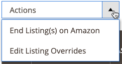

# Criar e editar sobreposições

É possível criar e substituir para uma lista ou editar ou remover uma substituição que tenha sido aplicada a uma lista. As substituições definem um valor definido para uma lista específica.

## Criar uma substituição para uma única lista

A variável _[!UICONTROL Create Override]_ação está disponível ao visualizar listagens na_[!UICONTROL Inactive]_, _[!UICONTROL Active]_, e_[!UICONTROL Ineligible]_ guias.

1. Exibir uma listagem em um _[!UICONTROL Products Listings]_página (_[!UICONTROL Inactive]_, _[!UICONTROL Active]_, e_[!UICONTROL Ineligible]_ guia ).

1. No _[!UICONTROL Action]_clique em **[!UICONTROL Select]**>**[!UICONTROL Create Override]**para abrir a página Sobreposições da Lista de Produtos.

   {width="220"}

1. Para garantir que você está visualizando a lista correta, verifique a _[!UICONTROL Listing Details]_.

1. Determine o tipo de sobreposição que está sendo criada.

   Você pode definir um único tipo de sobreposição ou qualquer combinação de tipos para a lista (Preço, Tempo de Manuseio, Condição, Notas do Vendedor).

   - **Preço** - Clique **[!UICONTROL Change Listing Price]** e informe o valor de preço definido para **[!UICONTROL Price Override]**.
   - **Tempo de manuseio** - Clique **[!UICONTROL Change Handling Time]** e insira o valor de tempo definido (em dias) para **[!UICONTROL Handling Time Override]**.
   - **Condição** - Clique **[!UICONTROL Change Condition]** e escolha a opção correta para a variável **[!UICONTROL Condition Override]**.
   - **Notas do vendedor** - Clique **[!UICONTROL Change Seller Notes]** e insira o texto das notas para **[!UICONTROL Seller Notes Override]**.

1. Clique em **[!UICONTROL Save Listing Override]**.

   A variável _[!UICONTROL Product Listing Overrides]_página fecha. O status da lista é alterado para `Relist in Progress`. A alteração será publicada no Amazon com a próxima sincronização de dados (conforme definido nas configurações cron). A lista também é adicionada à_[!UICONTROL Overrides]_ guia.

O exemplo a seguir mostra uma substituição que define um novo preço de `$55`, um novo tempo de manipulação de `1 day`, uma nova condição de `Used; Like New`e novo texto de Nota ao Vendedor.

{width="600" zoomable="yes"}

## Editar ou remover uma sobreposição de uma única lista {#edit-override-single-listing}

A variável _[!UICONTROL Edit Overrides]_ação está disponível ao visualizar listagens na_[!UICONTROL Overrides]_ guia.

1. Exibir uma listagem no _[!UICONTROL Product Listings]_página (_[!UICONTROL Overrides]_ guia ).

1. No _[!UICONTROL Action]_clique em **[!UICONTROL Select]**>**[!UICONTROL Edit Overrides]**.

   A variável _[!UICONTROL Product Listing Overrides]_é aberta.

   {width="125"}

1. Para garantir que você esteja substituindo a lista correta, verifique a _[!UICONTROL Listing Details]_.

1. Para editar suas _[!UICONTROL Override]_defina as seções para o tipo que deseja alterar (Preço, Tempo de Manuseio, Condição, Notas do Vendedor).

   Para manter o mesmo tipo de substituição, selecione `No Change To <override type>` (o padrão). Essa configuração deixa o valor de substituição definido anteriormente inalterado.

   - **Preço** - Clique **[!UICONTROL Change Listing Price]** e informe o valor de preço definido para **[!UICONTROL Price Override]**.
   - **Tempo de manuseio** - Clique **[!UICONTROL Change Handling Time]** e insira o valor de tempo definido (em dias) para **[!UICONTROL Handling Time Override]**.
   - **Condição** - Clique **[!UICONTROL Change Condition]** e escolha a opção correta para **[!UICONTROL Condition Override]**.
   - **Notas do vendedor** - Clique **[!UICONTROL Change Seller Notes]** e insira o texto das notas para **[!UICONTROL Seller Notes Override]**.

1. Para remover um tipo de substituição, clique em **Remover** para cada tipo que deseja remover. Se não for removido, o valor definido anteriormente permanecerá na substituição.

1. Clique em **[!UICONTROL Save Listing Override]**.

   A variável _[!UICONTROL Product Listing Overrides]_página fecha. O status da lista é alterado para `Relist in Progress`. A alteração será publicada no Amazon com a próxima sincronização de dados (conforme definido nas configurações cron). Se ainda não estiverem listadas, as listagens também serão adicionadas ao_[!UICONTROL Overrides]_ guia.

Acúmulo de lixo no _Criar uma sobreposição_ exemplo. O exemplo a seguir mostra uma edição da substituição criada anteriormente que define um novo preço de `$50`O remove a substituição de Tempo de manuseio e mantém as substituições anteriores de Condição e Notas do vendedor.

{width="600" zoomable="yes"}
__

## Editar ou remover uma substituição para várias listagens {#edit-override-multiple-listings}

A variável _[!UICONTROL Edit Listing Overrides]_a ação está disponível no_[!UICONTROL Inactive]_, _[!UICONTROL Active]_,_[!UICONTROL Overrides]_, e _[!UICONTROL Ineligible]_guias.

>[!NOTE]
>
>Como você está modificando sobreposições para várias listagens, a variável _[!UICONTROL Listing Details]_A seção não é exibida como ocorre ao modificar uma única lista.

1. Exibir a listagem em um _[!UICONTROL Products Listings]_página (_[!UICONTROL Inactive]_, _[!UICONTROL Active]_,_[!UICONTROL Overrides]_, e _[!UICONTROL Ineligible]_guia ).

1. Marque a caixa de seleção na coluna do lado esquerdo de cada listagem que você deseja modificar.

1. Em _[!UICONTROL Actions]_, clique em **[!UICONTROL Edit Listing Overrides]**.

   A variável _[!UICONTROL Product Listing Overrides]_é aberta.

   {width="200"}

1. Para editar suas _[!UICONTROL Override]_defina as seções para o tipo que deseja alterar (Preço, Tempo de Manuseio, Condição, Notas do Vendedor).

   Para manter uma sobreposição igual, selecione `No Change To <override type>` (padrão). Essa configuração deixa o valor de substituição definido anteriormente inalterado.

   - **Preço** - Clique **[!UICONTROL Change Listing Price]** e informe o valor de preço definido para **[!UICONTROL Price Override]**.
   - **Tempo de manuseio** - Clique **[!UICONTROL Change Handling Time]** e insira o valor de tempo definido (em dias) para **[!UICONTROL Handling Time Override]**.
   - **Condição** - Clique **[!UICONTROL Change Condition]** e escolha a opção correta para **[!UICONTROL Condition Override]**.
   - **Notas do vendedor** - Clique **[!UICONTROL Change Seller Notes]** e insira o texto das notas para **[!UICONTROL Seller Notes Override]**.

1. Para remover um tipo de substituição, clique em **[!UICONTROL Remove]** para cada tipo que deseja remover. Se não for removido, o valor definido anteriormente permanecerá na substituição.

1. Clique em **[!UICONTROL Save Listing Override]**.

   A variável _[!UICONTROL Product Listing Overrides]_página fecha. O status das listagens muda para `Relist in Progress`. A alteração será publicada no Amazon com a próxima sincronização de dados (conforme definido nas configurações cron). Se ainda não estiverem listadas, as listagens também serão adicionadas ao_[!UICONTROL Overrides]_ guia.

### Substituir tipos

| Substituir | Descrição |
|--- |--- |
| [!UICONTROL Price Override] | Uma substituição de preço define o preço das listagens. Essa substituição tem prioridade sobre todas as configurações automatizadas até que seja removida.  Para substituir o preço do seu produto, escolha **[!UICONTROL Change Listing Price]** e insira o novo preço para **[!UICONTROL Price Override]**. |
| [!UICONTROL Handling Time Override] | Uma substituição de tempo de manuseio define o tempo gasto (em dias) para processar e enviar produtos. Uma substituição de tempo de manuseio tem prioridade sobre todas as configurações de tempo de manuseio automatizadas e padrão até que a substituição seja removida.  O valor que existe na variável _[!UICONTROL Handling Time Override]_é o tempo de manipulação padrão definido no [configurações de listagem](./listing-settings.md) ou o tempo de manipulação de substituição definido. Se você remover uma substituição de tempo de manuseio, a lista assumirá como padrão o tempo de manuseio definido nas configurações da lista.  Para definir uma sobreposição de tempo de manuseio, escolha **[!UICONTROL Change Handling Time]**e insira o novo tempo de manuseio (em dias) para **[!UICONTROL Handling Time Override]**. |
| [!UICONTROL Condition Override] | Para sobrepor a Condição de Listagem, escolha **[!UICONTROL Change Condition]** e escolha a nova condição em **Substituição de Condição**. |
| [!UICONTROL Seller Notes Override] | Para produtos no catálogo definidos com uma condição diferente de `New`, uma nota ao vendedor pode ser adicionada para detalhar ainda mais seu produto e sua condição para possíveis compradores. É possível inserir uma substituição de nota de vendedor para um `New` condição do produto, mas o Amazon não exibe a nota.  Para substituir as Notas do Vendedor, escolha **[!UICONTROL Change Seller Notes]** e insira a nova nota para **[!UICONTROL Seller Notes Override]**. |
