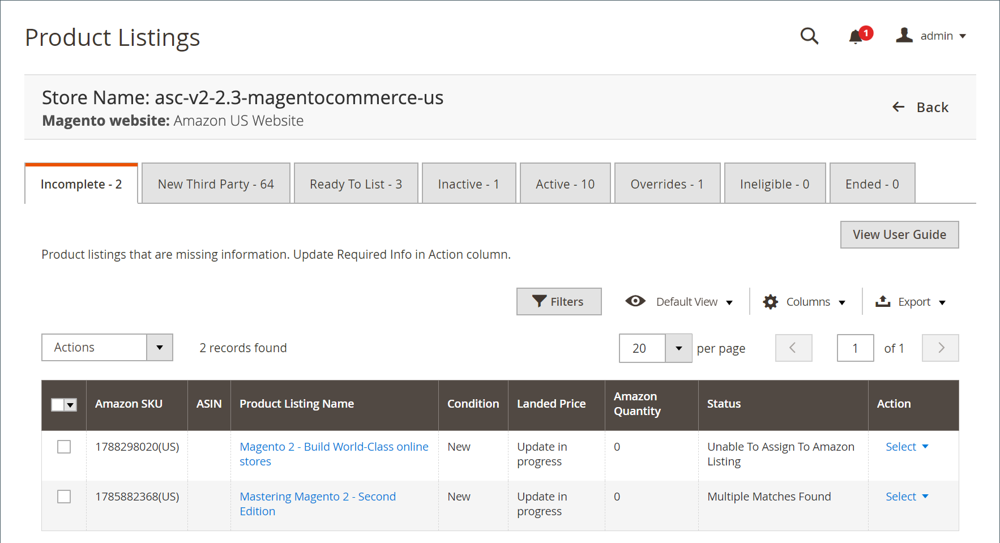

# Listagens incompletas do Amazon

A variável _[!UICONTROL Incomplete]_A guia lista as [!DNL Commerce] produtos de catálogo que atendem aos requisitos de qualificação da Amazon (definidos no [regras de listagem](./listing-rules.md)), mas faltam informações exigidas pelo Amazon (como a Amazon ASIN ou uma condição de produto definida).

Há quatro causas possíveis para uma listagem incompleta, cada uma identificada por seu status.

| Status | Motivo | Ação |
|--- |--- |--- |
| Condição ausente | A Amazon aceita listagens em várias condições (como _Novo_, _Recondicionado_, _Usado: Como novo_) exige uma condição definida. | Atualizar as informações necessárias e manualmente [atribuir uma condição](./amazon-manually-update-incomplete-listing.md#update-required-info-missing-condition) para uma lista. |
| Não é possível atribuir à listagem do Amazon | A correspondência automática desta listagem ao seu catálogo falhou. Se nenhuma correspondência for encontrada, a lista não poderá ser gerenciada pelo Amazon Sales Channel | Atualizar as informações necessárias e manualmente [atribuir um ASIN](./amazon-manually-update-incomplete-listing.md#update-required-info-unable-to-assign-to-amazon-listing) ao produto de catálogo para corresponder à lista. |
| Várias Correspondências Encontradas | A correspondência automática desta listagem ao seu catálogo falhou. Se várias correspondências possíveis forem encontradas, você deverá selecionar a correspondência correta para seu produto. | Atualizar as informações necessárias e manualmente [escolher uma correspondência de produto](./amazon-manually-update-incomplete-listing.md#update-required-info-multiple-matches-found) para o produto e a lista. |
| Têm variantes | Se seu produto tiver variantes, como uma camiseta disponível em diferentes tamanhos ou cores, escolha a variante no catálogo para ser atribuída corretamente e correspondida à lista | Atualizar as informações necessárias e manualmente [escolher a variante correta](./amazon-manually-update-incomplete-listing.md#update-required-info-has-variants) para atribuir e corresponder a esta lista. |

>[!NOTE]
>Quando as listagens incompletas são correspondidas corretamente aos seus produtos de catálogo, a listagem é movida da _[!UICONTROL Incomplete]_e são publicados no Amazon com base na sua [_[!UICONTROL Product Listing Actions]_](./product-listing-actions.md) configurações.

As ações disponíveis no _[!UICONTROL Incomplete]_incluem:

Em _[!UICONTROL Actions]_:

- **[!UICONTROL Re-attempt to auto match to Amazon listings]**: Opte por iniciar o processo automático para corresponder os dados das listagens do Amazon aos seus [!DNL Commerce] catálogo. Se os produtos não corresponderem automaticamente, revise o [_[!UICONTROL Catalog Search]_](./catalog-search.md) opções nas suas permissões de listagem. Se as listagens não corresponderem automaticamente após a atualização do _[!UICONTROL Catalog Search]_opções, é possível corresponder produtos manualmente no [[!UICONTROL Update Required Info]](./amazon-manually-update-incomplete-listing.md#update-required-info-multiple-matches-found) ação.

Em **[!UICONTROL Select]** no _[!UICONTROL Action]_coluna:

- **[!UICONTROL Update Required Info]**: escolha quando as listagens não corresponderem automaticamente ao catálogo. Você pode [corresponder produtos de catálogo às listagens](./amazon-manually-update-incomplete-listing.md#update-required-info-multiple-matches-found), manualmente [atribuir um ASIN](./amazon-manually-update-incomplete-listing.md#update-required-info-unable-to-assign-to-amazon-listing) para uma correspondência de catálogo, ou [atribuir uma condição ausente](./amazon-manually-update-incomplete-listing.md#update-required-info-missing-condition) para listagem.

- **[!UICONTROL View Details]**: Opte por exibir os detalhes da listagem, incluindo o [Log de atividades de listagem](./product-listing-details.md#listing-activity-log), [Preços do Concorrente Buy Box](./product-listing-details.md#buy-box-competitor-pricing), e [Menor preço para concorrentes](./product-listing-details.md#lowest-competitor-pricing). Esta ação é somente para exibição. Nenhuma alteração pode ser feita nos detalhes da lista. Consulte [Exibir detalhes](./product-listing-details.md).

>[!NOTE]
>
>Se você tiver listagens em andamento, o número de listagens aparecerá em uma mensagem acima das guias.

{width="600" zoomable="yes"}

As home pages dos canais de vendas do Amazon compartilham algumas informações [controles do espaço de trabalho](./workspace-controls.md) que permitem personalizar os dados exibidos.

| Coluna | Descrição |
|--- |--- |
| [!UICONTROL Amazon Seller SKU] | A SKU (Unidade de manutenção de estoque) atribuída pela Amazon a um produto para identificar o produto, as opções, o preço e o fabricante. |
| [!UICONTROL ASIN] | Um bloco exclusivo de 10 letras e/ou números que identificam itens.  ASIN significa [!DNL Amazon Standard Identification Number]. Um ASIN é um bloco exclusivo de 10 letras e/ou números que identificam itens. Para livros, o ASIN é o mesmo que o número ISBN, mas para todos os outros produtos, um novo ASIN é criado quando o item é carregado para o seu catálogo. Você pode encontrar um ASIN de itens na página de detalhes do produto no Amazon, juntamente com mais detalhes relacionados ao item. |
| [!UICONTROL Product Listing Name] | O nome do produto. |
| [!UICONTROL Condition] | A variável [condição](./product-listing-condition.md) do produto. |
| [!UICONTROL Landed Price] | O preço de listagem do produto mais seu preço de envio. |
| [!UICONTROL Amazon Quantity] | A quantidade disponível quando o produto está ativamente listado no Amazon. |
| [!UICONTROL Status] | O status da lista, definido pelo Amazon. Consulte a tabela Status acima. |
| [!UICONTROL Action] | Lista de ações disponíveis que podem ser aplicadas a uma lista específica. Para aplicar uma ação, clique em **[!UICONTROL Select]** no _[!UICONTROL Action]_e selecione uma opção:<ul><li>[[!UICONTROL Update Required Info]](./amazon-manually-update-incomplete-listing.md)</li><li>[[!UICONTROL View Details]](./product-listing-details.md)</li></ul> |
