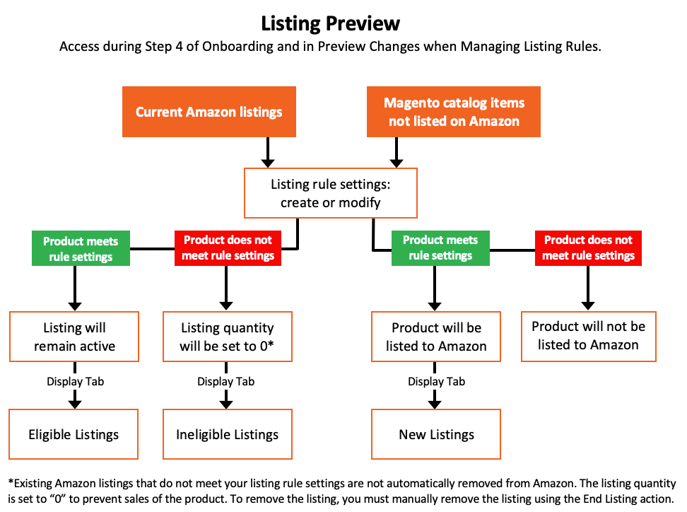

# [!UICONTROL Listing Rules]

Você pode acessar as regras de listagem da loja no [painel de loja](./amazon-store-dashboard.md).

As regras de listagem definem as regras para determinar quais produtos o canal de vendas da Amazon publica para a Amazon. Essas regras fornecem muitas opções para criar regras simples a complexas para incluir ou excluir produtos como listas. Cada regra consiste em condições que definem os requisitos de qualificação para a lista de produtos.

As regras de listagem são continuamente sincronizadas com o catálogo [!DNL Commerce]. Quando você adiciona novos produtos do [!DNL Commerce] que atendem aos requisitos de qualificação definidos pelas regras de lista, os produtos são processados automaticamente para listagem no Amazon.

- Se quiser que todos os seus produtos sejam publicados em uma lista do Amazon, não defina condições para as regras da lista.

- Se quiser limitar quais dos seus produtos de catálogo são publicados no Amazon, defina as condições da regra de listagem. A definição das condições para as regras de listagem do Amazon segue a mesma lógica e processo que a definição das condições para as [Regras de preço do carrinho](https://experienceleague.adobe.com/docs/commerce-admin/marketing/promotions/cart-rules/price-rules-cart.html).

- Se as regras de listagem excluírem um produto, o status de qualificação desse produto será alterado para `Ineligible`. Produtos não qualificados não são publicados no Amazon.

- Se um produto inelegível já estiver listado no Amazon e você corresponder a listagem do Amazon ao seu produto de catálogo [!DNL Commerce], a quantidade para a listagem do Amazon será alterada para `0` para impedir as vendas do produto. As listagens do Amazon podem ser [removidas manualmente](./end-listings-manually.md).

As alterações na quantidade e no status de qualificação afetam todas as listagens que compartilham o SKU do Vendedor da Amazon em marketplaces existentes para lojas que vendem na mesma região (como definido em _[!UICONTROL Amazon Marketplace Country]_durante a [integração de loja](./store-integration.md)). No entanto, uma alteração em um [!DNL Amazon Seller SKU] compartilhado em uma região não afeta as listagens do Amazon do produto em um país diferente.

{width="600" zoomable="yes"}

## Definir configurações de Regras de Listagem

1. Clique em **[!UICONTROL Listing Rules]** no painel da loja.

1. Defina as condições desejadas para a qualificação de produtos a serem listados no Amazon.

Consulte [Exemplo: Definir uma Condição](./ob-define-condition-example.md).

| Campo | Descrição |
|-------------------------|---------------------------------------------------------------------------------------------------------------------------------------------------------------------------------------------------------------------------------------------------------------------------------------------------------------------------------------------------------------------------------------|
| [!UICONTROL Websites] | As opções disponíveis dependem dos [sites](https://experienceleague.adobe.com/docs/commerce-admin/start/setup/websites-stores-views.html) configurados na sua configuração do [!DNL Commerce]. Selecione o site dos produtos qualificados listados no Amazon. Somente um site pode ser selecionado, pois cada site requer uma loja exclusiva do Amazon criada no canal de vendas do Amazon. |
| [!UICONTROL Conditions] | Usado para definir os atributos [!DNL Commerce] para qualificação de produto na região do Amazon. Consulte [Exemplo: Definir uma Condição](./ob-define-condition-example.md). |

## Espaço de trabalho Condições

É possível clicar em qualquer área nas condições em negrito para ver as várias opções.

- Não adicione condições se todos os produtos nos sites selecionados estiverem qualificados.
- Há um conjunto complexo de processos de back-end para se comunicar diretamente com os sistemas da Amazon. Com base no número de itens que você está tentando listar e na ocupação dos sistemas da Amazon (como Black Friday), pode levar algum tempo para que seus itens sejam listados no Amazon.

Para obter mais informações sobre condições, consulte [Descrever as Condições](https://experienceleague.adobe.com/docs/commerce-admin/marketing/promotions/cart-rules/price-rules-cart.html).

## Visualização da regra de listagem

Ao modificar as definições de condição para as regras de listagem, você pode clicar em **[!UICONTROL Preview Changes]** para aplicar as alterações das regras e visualizar como as suas listagens são afetadas. Verifique suas listas neste recurso de visualização de lista antes de salvar as alterações na regra de lista.

As listagens do Amazon são comparadas com as regras e condições definidas. Em seguida, é possível revisar:

- Quais produtos são movidos para um status de inelegível com base em sua conta atual do [!DNL Amazon Seller Central]
- Quais produtos mudam de um estado inelegível para o status elegível
- Quais produtos são as Novas Listagens do Amazon e adicionados à sua lista do Amazon de seus produtos qualificados do [!DNL Commerce]

A Visualização de listagens permite que você visualize suas listagens potenciais do Amazon e faça os ajustes necessários nas regras da listagem.

Suas possíveis listagens do Amazon são preenchidas na página _[!UICONTROL Listing Preview]_em uma das três guias:

- **[!UICONTROL Ineligible Listings]** - Os produtos listados não estão qualificados para a lista do Amazon com base nas regras e condições da lista atual.

  Produtos não qualificados não são publicados no Amazon. Se um produto inelegível já estiver listado no Amazon e você corresponder a listagem do Amazon ao seu produto de catálogo [!DNL Commerce], a quantidade para a listagem do Amazon será alterada para `0` para impedir as vendas do produto. Para remover manualmente uma listagem, consulte [Encerrando uma Listagem do Amazon](./end-listings-manually.md). Os produtos que não estão qualificados pelos requisitos do Amazon não estão listados aqui. Esses produtos estão listados na [guia Listagens Inativas](./inactive-listings.md).

- **[!UICONTROL Eligible Listings]** - Os produtos listados são qualificados para a lista do Amazon com base em suas regras e condições de lista atuais e também são qualificados pelos requisitos do Amazon. Esta lista inclui suas listagens existentes do Amazon que são importadas (se você tiver **Importar Listagens de Terceiros** definido como `Import Listing` em [Configurações de Listagem](./third-party-listing-settings.md)).

- **[!UICONTROL New Listings]** - Os produtos listados incluem seus produtos de catálogo do [!DNL Commerce], que são recém-qualificados para a listagem do Amazon com base em suas regras e condições de listagem atuais, e criam e publicam novas listagens do Amazon.

### Visualizar sua lista

1. Clique em **[!UICONTROL Listing Rules]** no painel da loja.

1. Exiba ou adicione suas [regras de listagem](./listing-rules.md).

1. Modifique suas [Condições de Regra de Listagem](./ob-define-condition-example.md).

1. Clique em **[!UICONTROL Preview Changes]**.

1. Revise e confirme suas listas nas guias _[!UICONTROL Ineligible Listings]_,_[!UICONTROL Eligible Listings]_ e _[!UICONTROL New Listings]_.

1. Se suas listas atenderem às suas expectativas, clique em **[!UICONTROL Save and close]**.

   Se suas listas não aparecerem conforme esperado, clique em **[!UICONTROL Back]** e modifique suas regras e condições até que suas listas atendam às suas expectativas.

{width="600" zoomable="yes"}

### Listando registros de visualização

| Campo | Descrição |
|----------------------------|---------------------------------------------------------------------------------------------------------------------------------------------------------------------------------------------------------|
| [!UICONTROL Product ID] | O número sequencial exclusivo que é atribuído a um produto de catálogo [!DNL Commerce] quando adicionado. |
| [!UICONTROL Thumbnail] | Mostra uma miniatura da imagem principal do produto. |
| [!UICONTROL Name] | O nome do produto, gerenciado na [!DNL Commerce] [grade de produtos](https://experienceleague.adobe.com/docs/commerce-admin/catalog/products/products-list.html). |
| [!UICONTROL Type] | O tipo de produto, gerenciado na grade de produtos [!DNL Commerce]. |
| [!UICONTROL Attribute Set] | O nome do conjunto de atributos usado como modelo para o produto, gerenciado na grade de produtos [!DNL Commerce]. |
| [!UICONTROL SKU] | A Unidade de Manutenção de Estoque exclusiva atribuída ao produto, gerenciada na grade de produtos [!DNL Commerce]. |
| [!UICONTROL Visibility] | Indica onde o produto está visível, gerenciado na grade de produtos [!DNL Commerce]. Opções:<ul><li>`Not visible individually`</li><li>`Catalog`</li><li>`Search`</li><li>`Catalog, Search`</li></ul> |
| Status | Indica o status do produto, gerenciado na grade de produtos [!DNL Commerce]. Opções: `Enabled` / `Disabled` |

{width="500" zoomable="yes"}
