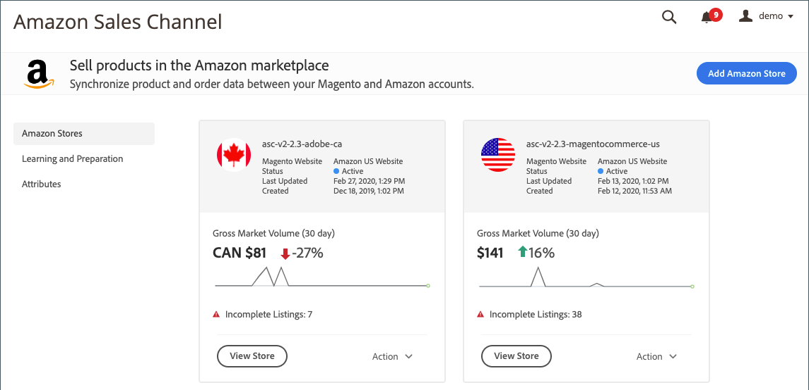

# Exibição das Amazon Stores

Ao visualizar a página inicial do canal de vendas do Amazon, a visualização _Amazon Stores_ é aberta por padrão.

A visualização _[!UICONTROL Amazon Stores]_mostra um &quot;cartão de loja&quot; para cada loja da Amazon junto com algumas estatísticas básicas e opções de gerenciamento. As informações de resumo mostradas em cada cartão incluem cada status de loja, data de criação, data da última atualização, listas que precisam de atenção (por exemplo: Listagens incompletas) e o site atribuído [!DNL Commerce].

Ao visualizar a visualização _[!UICONTROL Amazon Store]_, cada cartão de loja permite:

- Para abrir um armazenamento [painel](./amazon-store-dashboard.md), clique em **[!UICONTROL View Store]**.

- Para alterar um status de armazenamento ou excluir um armazenamento, clique em **[!UICONTROL Action]** e escolha:

   - **[!UICONTROL Activate]** /  **[!UICONTROL Deactivate]**  - Escolha alterar o status da loja para  `Active` ou  `Inactive`, respectivamente.

      Alterar um status `Inactive` de armazenamento para `Active` ativa as listagens e a atividade de pedido da loja, usando as configurações de armazenamento atuais da loja (como configurações de listagem, regras de preço e substituições).

      Alterar o status de uma loja de `Active` para `Inactive` suspende as listagens e a atividade de pedido da loja. Uma loja Inativa retém todas as configurações de armazenamento e listagens, mas interrompe temporariamente a sincronização de preços, quantidade e gerenciamento de pedidos até que a loja seja alterada de volta para o status `Active`. Esse recurso permite controlar a atividade da loja no nível regional, sem a necessidade de recriar ou reintegrar a loja da Amazon ou a perda de dados históricos de pedido e vendas.

   - **[!UICONTROL Delete]** - Escolha excluir uma loja que não é mais necessária.

      Escolha quando deseja excluir um armazenamento Amazon existente e suas configurações de integração com sua conta [!DNL Amazon Seller Central]. A exclusão da conta remove a loja do canal de vendas da Amazon, juntamente com todas as configurações da conta, listas, logs e outras informações relacionadas a essa loja. O armazenamento não pode ser recuperado após a exclusão. Um novo armazenamento deve ser criado.

>[!NOTE]
>Para alterar o site atribuído à loja durante a integração, você deve excluir a loja e adicionar a loja novamente com o site diferente definido durante a integração da loja.

| Cartão de armazenamento | Descrição |
|--- |--- |
| Seção superior | Inclui:  O ícone de região da loja, definido durante [integração de loja](./store-integration.md).  O atribuído  _[!UICONTROL Magento Website]_, definido durante a integração de loja. O_[!UICONTROL Status]_ da sua loja. Opções: **[!UICONTROL Active]** - A integração de loja é concluída e verificada com o Amazon e está disponível para atividade de vendas. **[!UICONTROL Inactive]** - A integração de armazenamento está concluída, mas não está em uso ou disponível para a atividade de vendas. Quando `Inactive`, suas vendas da Amazon são pausadas. Quando `Active`, a receita de vendas e as configurações adicionais são salvas para atualização antes da ativação. A  *[!UICONTROL Last Updated]* data da alteração mais recente na configuração da loja da Amazon. A  *[!UICONTROL Created]* data em que a loja da Amazon foi criada no canal de vendas da Amazon. |
| Seção do meio | Inclui um gráfico resumido de atividades de loja nos últimos 30 dias e inclui e alerta para qualquer lista que precise de atenção. |
| Seção inferior | Inclui as opções Exibir armazenamento e Ação . Para abrir o  [painel](./amazon-store-dashboard.md) da loja, clique em  **[!UICONTROL View Store]**. Para ativar, desativar ou excluir uma loja, clique em  **[!UICONTROL Actions]**. |
