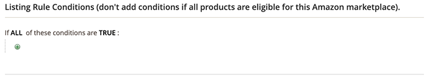

# Exemplo: Definir uma condição

## Condições

Qualquer área nas condições em negrito pode ser clicada para ver as várias opções.

**Não adicione condições se todos os produtos do site selecionado estiverem qualificados.**

>[!NOTE]
>
>Há um conjunto complexo de processos de back-end para se comunicar diretamente com os sistemas Amazon. Com base no número de itens que você está tentando listar e no quão ocupados os sistemas Amazon podem estar (como Black Friday), pode levar tempo para que seus itens sejam listados no Amazon.

Consulte a seção Condições de [Criando uma regra de preço do carrinho](https://docs.magento.com/user-guide/marketing/price-rules-catalog-create.html){target=&quot;_blank&quot;}.

## Definir uma condição

Esse processo pode ser simples ou detalhado, dependendo da configuração do catálogo. Você pode configurar suas condições para que quando `ALL` ou `ANY` das condições definidas são: `TRUE` ou `FALSE` para um produto, o produto está qualificado para ser listado no Amazon.

As condições são baseadas em valores de atributos do produto existentes. Para aplicar a regra a todos os produtos, deixe a seção condições em branco.

>[!NOTE]
>
>Se quiser definir uma condição com base em um atributo de produto específico, defina a variável **[!UICONTROL Use for Promo Rule Conditions]** configuração do atributo para `Yes`. Você pode acessar essa configuração no [Propriedades da frente de loja](https://docs.magento.com/user-guide/catalog/product-attributes-add.html)página {target=&quot;_blank&quot;} para o atributo.

A regra neste exemplo define uma regra que define a elegibilidade do Amazon para todos os produtos de catálogo que têm a variável _Amazon FBA_ conjunto de atributos para `Yes`.

A instrução da regra tem dois links em negrito, que, quando clicados, exibem as opções para essa parte da instrução. Se você salvar a condição sem alterar uma opção em negrito, a regra se aplica a todos os seus produtos.

- Clique em **[!UICONTROL ALL]** e escolheu `ALL` ou `ANY`.
- Clique em **[!UICONTROL TRUE]** e escolha `TRUE` ou `FALSE`.
- Para aplicar a regra a todos os produtos, mantenha a condição inalterada.

Você pode criar condições diferentes alterando a combinação desses valores. Neste exemplo, a seguinte condição é usada:

`If ALL of these conditions are TRUE:`

1. Clique em Adicionar () ícone no início da linha de condição e selecione um atributo no qual basear a condição, como uma combinação de condições ou um atributo de produto.

   - **[!UICONTROL Conditions Combination]** - Escolha permitir que você crie outro conjunto de `All/Any` e `True/False` dentro do conjunto existente.

      

   - **[!UICONTROL Product Attribute]** - Os atributos do produto dependem da configuração do atributo. Para que um atributo apareça na lista, ele deve ser configurado para uso em condições de regras promocionais. Consulte a _Usar para condições de regra promocional_ em [Atributos do produto](https://docs.magento.com/user-guide/stores/attributes-product.html){target=&quot;_blank&quot;}.

      Na lista em **[!UICONTROL Product Attribute]**, escolha o atributo que deseja usar como base da condição. Para este exemplo, a condição selecionada é `Amazon FBA`.

      

      A condição selecionada aparece na instrução, seguida por mais dois links em negrito. As opções diferem dependendo do atributo de produto selecionado.

      Após definir o atributo, ele não pode ser alterado. Para alterar o atributo, você deve excluir a linha e adicionar o novo atributo. Você pode excluir uma linha de condição clicando no botão Excluir () no final da linha.

      1. Clique em **[!UICONTROL is]** e escolha o operador de comparação que descreve a condição para que os produtos atendam.

         Neste exemplo, o operador de comparação é `is`. As opções disponíveis dependem do atributo selecionado na etapa anterior. As opções podem incluir opções de comparação diferentes, como valores correspondentes, não incluindo ou incluindo pelo menos um de um valor e maior que, igual a e menor que um valor numérico. Neste exemplo, as opções são `is` e `is not`.

      1. Clique em **[!UICONTROL ...]** e escolha o valor do atributo no qual a condição se baseia.

         As opções dependem da configuração do atributo. Você pode ser solicitado a selecionar uma opção ou a inserir valores de texto ou numéricos para a condição. Neste exemplo, a seleção é `Yes`.

         O item selecionado aparece na instrução para concluir a condição.

         
   Essa condição foi concluída. Conforme dito, essa condição significa que qualquer produto em seu [!DNL Commerce] catálogo que tem o atributo FBA do Amazon definido como um valor de `Yes` está qualificado para listar a Amazon da região e da loja. Você pode adicionar mais linhas de condição para restringir ainda mais seus produtos qualificados.

1, Para adicionar outra linha de condição à declaração, volte para a etapa 1 e repita o processo até que todas as condições desejadas sejam concluídas.

Você pode excluir uma linha da declaração de condição a qualquer momento clicando no botão Excluir () no final da linha.
