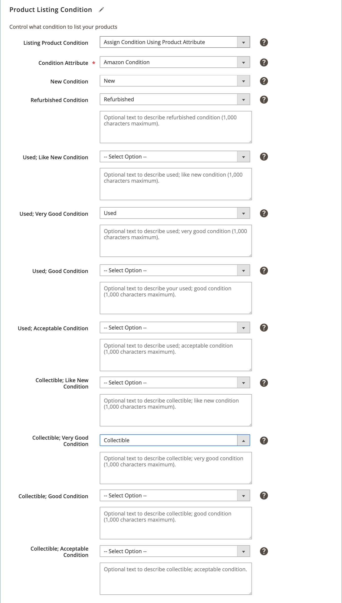

# Condição de listagem do produto

As configurações de condição da listagem de produtos fazem parte das configurações da listagem de lojas. Você pode acessar as configurações da listagem no [painel de loja](./amazon-store-dashboard.md).

O Amazon requer uma lista de produtos para ter uma condição definida. Se todos os seus produtos forem a mesma condição, você poderá selecionar uma das opções de condição do Amazon para representar todos os seus produtos como o valor de condição global. As condições padrão do Amazon incluem:

- `New`
- `Refurbished`
- `Used; Like New`
- `Used; Very Good`
- `Used; Good`
- `Used; Acceptable`
- `Collectible; Like New`
- `Collectible; Very Good`
- `Collectible; Good`
- `Collectible; Acceptable`

>[!IMPORTANT]
>
>Se você vender produtos renovados (recondicionados), deverá se inscrever no [!DNL Amazon Renewed Program]. Consulte [Produtos Renovados](./renewed-products.md).

No entanto, se o catálogo contém produtos em condições diferentes (como Novo, Usado e Refurorado), você deve escolher **[!UICONTROL Assign Condition Using Product Attribute]**. Essa configuração permite mapear o [!DNL Commerce] atributo de condição e valores para as condições da sua listagem do Amazon.

Durante [Tarefas de pré-configuração](./amazon-pre-setup-tasks.md), é recomendável criar um [!DNL Commerce] atributo de produto para a condição de um produto. Se você oferecer produtos em várias condições e não tiver criado um atributo de condição, consulte [Crie um atributo de produto em [!DNL Commerce]](./ob-creating-magento-attributes.md). Após criar o atributo de condição, é possível atribuir um valor de condição a cada um dos produtos em [!DNL Commerce] catálogo.

## Definir configurações

1. Clique em **[!UICONTROL Listing Settings]** no painel da loja.

1. Expanda o **[!UICONTROL Product Listing Condition]** seção.

1. Para **[!UICONTROL Listing Product Condition]**, escolha uma opção.

   Escolha uma das condições padrão do Amazon para seu valor de condição global para todas as suas listagens. A configuração padrão é `New`.

   Se você tiver produtos/listagens que tenham condições diferentes, escolha `Assign Condition Using Product Attribute` para definir as configurações da condição do produto nos campos adicionais exibidos.

1. Para **Atributo de condição**, escolha o [!DNL Commerce] atributo para mapear valores para cada um dos atributos de condição padrão do Amazon.

   Se você tiver produtos na `Used` ou `Collectible` , mas você não faz distinção, é possível mapear para uma única `Used` ou `Collectible` Amazon e deixe as outras em branco. Este método mapeia todos os `Used` ou `Collectible` para a única condição Amazon Usada ou Coletiva.

   Por exemplo, você tem um único `Used` para seus produtos. Ao mapear, você escolhe se deseja mapear para a condição do Amazon `Used; Like New`, `Used; Very Good`, `Used; Good`ou `Used; Acceptable`. Preencha o campo somente para a condição Amazon desejada, deixando a outra `Used` opções definidas como `--Select Option--`. Na imagem de exemplo, tudo [!DNL Commerce] produtos em `Used` são mapeadas para a Amazon `Used; Very Good` condição.

   Você também pode inserir texto descritivo para suas condições, exceto `New`.

1. Ao concluir, clique em **[!UICONTROL Save listing settings]**.

| Campo | Descrição |
|---|---|
| [!UICONTROL Listing Product Condition] | A condição das suas listas de produtos. Opções: `New` / `Refurbished` / `Used: Like New` / `Used: Very Good` / `Used: Good` / `Used: Acceptable` / `Collectible: Like New` / `Collectible: Very Good` / `Collectible: Good` / `Collectible: Acceptable` / `Assign Condition Using Product Attribute`  Se você vender uma única condição de produto, escolha uma das condições padrão do Amazon. Se o seu [!DNL Commerce] catálogo contém produtos em várias condições, escolha `Assign Condition Using Product Attribute`. |
| [!UICONTROL Condition Attribute] | O [!DNL Commerce] que define a condição para seus produtos. Selecione o atributo Magneto criado para mapear para o atributo de condição do Amazon. No [Exemplo de tarefas de pré-configuração](./ob-creating-magento-attributes.md) A recomenda nomeá-la como `Amazon Condition`. Quando selecionados, campos adicionais são exibidos para mapear as condições padrão do Amazon. |
| [!UICONTROL Additional Condition fields] | Para cada uma das condições padrão do Amazon, escolha a condição correspondente. As opções são os rótulos de condição adicionados quando você [criou o atributo de condição Amazon](./ob-creating-magento-attributes.md).  Se você tiver produtos na `Used` ou `Collectible` , mas você não faz distinção, é possível mapear para uma única `Used` ou `Collectible` Amazon e deixe as outras em branco. Este método mapeia todos `Used` ou `Collectible` para a única condição Amazon Usada ou Coletiva. |

**Acesso rápido** - [!UICONTROL Listing Settings] seções

- [[!UICONTROL Product Listing Actions]](./product-listing-actions.md)
- [[!UICONTROL Third Party Listings]](./third-party-listing-settings.md)
- [[!UICONTROL Listing Price]](./listing-price.md)
- [[!UICONTROL (B2B) Business Price]](./business-pricing.md)
- [[!UICONTROL Stock / Quantity]](./stock-quantity.md)
- [[!UICONTROL Fulfilled By]](./fulfilled-by.md)
- [[!UICONTROL Catalog Search]](./catalog-search.md)
- [[!UICONTROL Product Listing Condition]](./product-listing-condition.md)
