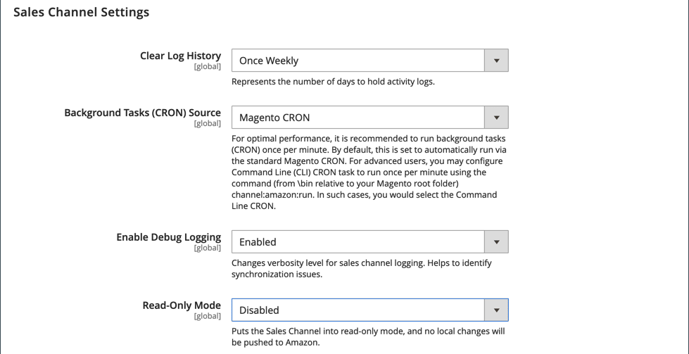

# Configurações do canal de vendas

Quando a variável [!DNL Amazon Sales Channel] for instalada, os valores padrão serão definidos no Admin para o canal de vendas do Amazon. Essas configurações podem ser modificadas nas configurações da loja da Amazon. Essas configurações incluem:

- Intervalos para limpar o histórico do log de atividades
- Seleção da origem do Cron
- Opções de sincronização de log

## Modificar as configurações de canais do Commerce

1. No _Admin_ barra lateral, vá para **[!UICONTROL Stores]** > _[!UICONTROL Settings]_>**[!UICONTROL Configuration]**.

1. No painel esquerdo, expanda **[!UICONTROL Sales Channels]** e escolha **[!UICONTROL Global Settings]**.

1. Para **[!UICONTROL Clear Log History]**, escolha uma opção:

   - `Once Daily` - Opte por limpar o histórico de atividades da loja uma vez por dia.

   - `Once Weekly` - Opte por limpar o histórico de atividades da loja uma vez por semana.

   - `Once Monthly` - (Padrão) Opte por limpar o histórico de atividades da loja uma vez por mês.

1. Para **[!UICONTROL Background Tasks (CRON) Source]**, escolha `Magento CRON`.

   Essa opção permite que o canal de vendas da Amazon use sua [!DNL Commerce] [Cron](https://experienceleague.adobe.com/docs/commerce-admin/systems/tools/cron.html) configurações para determinar intervalos de comunicação e sincronização de dados com [!DNL Amazon Seller Central].

1. Para **[!UICONTROL Enable Debug Logging]**, escolha `Enabled` para coletar dados adicionais de sincronização quando a solução de problemas for necessária.

   O registro do canal de vendas da Amazon é gravado no `{Commerce Root}/var/log/channel_amazon.log` arquivo e pode ser visualizado em [modo de desenvolvedor](https://experienceleague.adobe.com/docs/commerce-admin/systems/tools/developer-tools.html#operation-modes). O registro só deve ser `Enabled` durante a solução de problemas e deve ser `Disabled` quando a solução de problemas estiver concluída.

1. Para **[!UICONTROL Read-Only Mode]**, selecione `Enabled` para bloquear todas as solicitações de API que mudam de estado de saída.

   Com essa configuração, as alterações potenciais são salvas, mas não enviadas, até [!UICONTROL Read-Only Mode] está desativado. O cache de configuração deve ser limpo para que o Modo Somente Leitura seja habilitado. Para iniciar as transferências de dados novamente, selecione `Disabled`.

   >[!IMPORTANT]
   >
   >[!UICONTROL Read-Only Mode] O foi projetado para cópias da instância de Produção, como preparo ou controle de qualidade, e não deve ser usado na instância de produção.
   >
   >Quando um banco de dados é migrado para uma nova cópia da instância (detectado quando o URL de um armazenamento muda na configuração), [!UICONTROL Read-Only Mode] O é ativado automaticamente.

1. Clique em **[!UICONTROL Save Config]**.

{width="600" zoomable="yes"}
