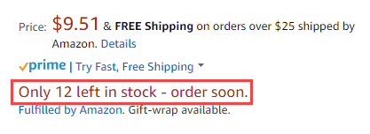

# [!UICONTROL Stock/Quantity]

*[!UICONTROL Stock/Quantity]* as configurações fazem parte das configurações da lista de lojas. As configurações de listagem são acessadas no [painel de armazenamento](./amazon-store-dashboard.md).

Essas configurações são usadas para sincronizar os detalhes de quantidade do produto do [!DNL Commerce] vitrine para a quantidade em seu [!DNL Amazon Seller Central] conta. Esta ferramenta é poderosa e pode ser usada para publicidade adicional exibindo urgência para o comprador, mantendo seu inventário organizado. Por exemplo, alguns comerciantes podem ter 150 itens de um SKU específico em estoque em seu depósito e desejam garantir que os compradores do Amazon possam comprar todo o inventário. Outros comerciantes podem querer listar apenas um item de cada vez para criar uma sensação de escassez para o usuário final. Nesse caso, defina o *[!UICONTROL Maximum Listed Quantity]* para `1`.

Quantidade é um atributo regional e com base na variável **[!UICONTROL Amazon Marketplace Country]** configuração definir durante [integração de loja](./store-integration.md). Quando uma alteração é feita na quantidade de um produto, ela afeta todas as listagens do Amazon que compartilham essa quantidade [!DNL Amazon Seller SKU] em suas lojas Amazon que vendem no mesmo país. Uma alteração em um compartilhamento [!DNL Amazon Seller SKU] nos Estados Unidos não afeta suas lojas Amazon configuradas para um país diferente. Sua primeira loja do Amazon integrada (com a data de criação mais antiga) controla a prioridade nas configurações de quantidade.

>[!NOTE]
>
>Para usuários do Adobe Commerce e do Magento Open Source 2.3.x, o canal de vendas da Amazon suporta o uso da extensão Inventory management sem nenhuma configuração adicional. Consulte [Gerenciar inventário](https://docs.magento.com/user-guide/v2.3/catalog/inventory-management.html){target="_blank"}.

## Definir configurações de estoque/quantidade {#configure-stock--quantity-settings}

1. Clique em **[!UICONTROL Listing Settings]** no painel da loja.

1. Expanda a **[!UICONTROL Stock / Quantity]** seção.

1. Para **[!UICONTROL Out-of-Stock Threshold]** (obrigatório), insira um valor numérico para a quantidade mais baixa de um produto para manter o produto qualificado para sua lista do Amazon.

   O padrão é `0`. Se o seu [!DNL Commerce] o estoque do produto exceder esse número, a respectiva lista do Amazon não é elegível para vendas por meio do Amazon.

1. Para **[!UICONTROL Maximum Listed Quantity]** (obrigatório), digite um valor numérico para a quantidade que deseja mostrar na lista do Amazon.

   Essa configuração lista todas as listas do Amazon qualificadas no valor inserido. Quando um item é vendido, a quantidade da lista do Amazon não é alterada. A quantidade da lista disponível sempre usa esse valor, mesmo quando a quantidade real do produto é maior ou menor. Normalmente, essa configuração é usada quando você não gerencia o inventário de produtos. Por exemplo, você pode ter um produto com uma quantidade de 80 no [!DNL Commerce] catálogo. Com definido como `10`, a lista Amazon sempre exibe uma quantidade disponível de `10` e não é alterado quando a venda é feita para o produto.

1. Para **[!UICONTROL "Do Not Manage Stock" Quantity]** (obrigatório), digite um valor de quantidade a ser exibido para as listagens do Amazon.

   O Amazon exige que você publique uma quantidade disponível. Para [!DNL Commerce] produtos definidos para não gerenciar estoque, mas você deseja listá-los no Amazon, a lista é publicada com a quantidade disponível inserida aqui.

1. Quando terminar, clique em **[!UICONTROL Save listing settings]**.

{width="600" zoomable="yes"}

| Campo | Descrição |
|---|---|
| [!UICONTROL Out-of-Stock Threshold] | Insira um valor numérico para a quantidade mais baixa de um produto para manter o produto qualificado para sua lista da Amazon (o padrão é `0`).  Se o seu [!DNL Commerce] o estoque do produto exceder esse número, a respectiva lista do Amazon não é elegível para vendas por meio do Amazon. |
| [!UICONTROL Maximum Listed Quantity] | Insira um valor numérico para a quantidade que deseja mostrar na lista do Amazon.  Quando um item é vendido, a lista do Amazon é republicada com a quantidade inserida aqui. Normalmente, essa configuração é usada quando você não gerencia o inventário de produtos.  Por exemplo, você informa o valor Quantidade Máxima Listada como `10`. A quantidade real de um produto é `80`. Porque você definiu esse valor como `10`, a lista Amazon sempre exibe uma quantidade disponível de `10`. A quantidade disponível é sempre exibida com o valor definido, mesmo quando a quantidade em estoque é menor. |
| [!UICONTROL "Do Not Manage Stock" Quantity] | Insira um valor para a quantidade de exibição das listagens do Amazon.  O Amazon exige que você publique uma quantidade disponível. Para [!DNL Commerce] produtos definidos para não gerenciar estoque, mas você deseja listá-los no Amazon, a lista é publicada com a quantidade disponível do valor inserido aqui. |

**Acesso rápido** - [!UICONTROL Listing Settings] seções

- [[!UICONTROL Product Listing Actions]](./product-listing-actions.md)
- [[!UICONTROL Third Party Listings]](./third-party-listing-settings.md)
- [[!UICONTROL Listing Price]](./listing-price.md)
- [[!UICONTROL (B2B) Business Price]](./business-pricing.md)
- [[!UICONTROL Stock / Quantity]](./stock-quantity.md)
- [[!UICONTROL Fulfilled By]](./fulfilled-by.md)
- [[!UICONTROL Catalog Search]](./catalog-search.md)
- [[!UICONTROL Product Listing Condition]](./product-listing-condition.md)

## Exemplo: quantidade máxima listada

Quando um item é vendido, a lista do Amazon o lista nesta quantidade.

Por exemplo, se você definir *[!UICONTROL Maximum Listed Quantity]* as `12`, a lista do Amazon mostra uma quantidade de 12, mesmo que o produto tenha uma [!DNL Commerce] quantidade de 80:

{width="300"}

Se você definir seu *[!UICONTROL Maximum Listed Quantity]* as `1`, todos os produtos elegíveis são enumerados com uma quantidade de `1`. Quando um item é vendido, o sistema examina o [!DNL Commerce] produto e, se houver estoque adicional, confia o item no Amazon com uma quantidade de `1`.

Essa opção pode ser valiosa para produtos que normalmente são solicitados na quantidade de 1. Isso também aumenta a urgência para o comprador ao visualizar sua lista do Amazon.

{width="300"}
