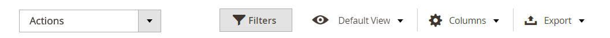
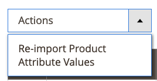
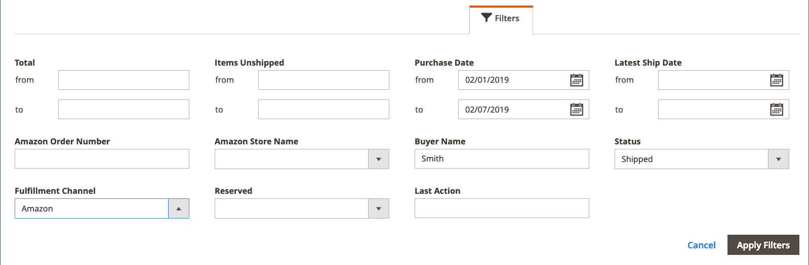

# Controles do Workspace

O canal de vendas da Amazon [página inicial](./amazon-sales-channel-home.md) O tem alguns controles comuns do espaço de trabalho, incluindo Filtros, Exibição padrão, Colunas e Exportar. Nem todas as páginas têm as mesmas opções de controle.

## Ações

O _[!UICONTROL Actions]_O seletor fornece uma lista de ações que estão disponíveis para um usuário para uma página. Quando escolhida, a ação é aplicada a todos os itens selecionados. Para aplicar uma ação a um item específico, marque a caixa de seleção na primeira coluna de cada item e escolha uma opção em_[!UICONTROL Actions]_.

Por exemplo, quando o seletor é exibido na _[!UICONTROL Attributes]_inclui a variável_[!UICONTROL Re-import Product Attribute Values]_ ação. A escolha dessa ação pings no [!DNL Amazon Seller Central] e atualiza a [!DNL Commerce] dados de cada um dos itens de armazenamento do Amazon marcados na coluna à esquerda.

## Filtros

O _[!UICONTROL Filters]_controle mostra opções para restringir os dados mostrados na tabela. As opções de filtro são baseadas nas colunas selecionadas no controle Colunas . As opções de filtro são exibidas somente para colunas ativadas no controle Colunas .

Os controles de Filtros podem incluir calendários dinâmicos para restringir dados de datas especificadas, menus suspensos para colunas que têm seleções predefinidas e campos de texto livre que podem conter dados personalizados.

O exemplo a seguir mostra as configurações para filtrar a lista de pedidos para mostrar somente pedidos que atendem aos seguintes critérios:

- Pedidos colocados entre 2/01/2019 e 2/07/2019, e
- Pedidos com um comprador nomeado de `Smith`e
- Pedidos com status de `Shipped`.

Quando as opções de filtragem estiverem definidas, clique em **[!UICONTROL Apply Filters]** para filtrar os dados listados. Clique em Cancelar para sair do controle Filtros sem aplicar.

Depois de aplicar filtros aos seus dados, **[!UICONTROL Active Filters]** serão exibidas. Você pode clicar no botão  ícone para limpar uma opção de filtro específica ou clique em **[!UICONTROL Clear All]** para limpar todos os filtros aplicados.

## Exibir

O controle Exibição é baseado nas colunas padrão da página, portanto, ele é nomeado como Exibição padrão. Você pode adicionar ou remover colunas disponíveis usando o controle Colunas . Ao personalizar suas colunas, você pode salvar a exibição como uma exibição personalizada no controle Exibição.

Quando suas colunas são adicionadas ou removidas da exibição de página:

1. Clique em **[!UICONTROL Default View]** > **[!UICONTROL Save View As...]**.

1. Insira um nome para exibição.

1. Para salvar a visualização personalizada, clique no ícone de seta.

Neste exemplo, a variável _ID do pedido_ é adicionada no controle Coluna e salva como uma visualização personalizada. Observe que, depois que o nome da exibição personalizada foi salvo, o nome da Exibição mudou de _Exibição padrão_ ao nome inserido.

Você pode alternar entre as exibições selecionando a exibição desejada no _[!UICONTROL View]_menu.

Se quiser excluir ou alterar o nome da sua exibição personalizada, clique no ícone de lápis. É possível inserir um nome diferente ou clicar no ícone da lixeira para excluir a visualização personalizada. Não é possível eliminar a Vista Predefinida.

## Colunas

O controle Columns permite adicionar ou remover colunas de dados da exibição da página. Cada página de canal de vendas da Amazon tem uma combinação predefinida de colunas de dados, mas a maioria das páginas tem colunas adicionais disponíveis. Se nenhuma coluna adicional estiver disponível, você ainda poderá remover as colunas padrão da exibição.

O exemplo a seguir mostra um controle de Colunas . As opções marcadas correspondem aos cabeçalhos de coluna que são mostrados na página.

- Para adicionar uma coluna de dados à página, marque a caixa de seleção .
- Para remover uma coluna de dados da página, não marque a caixa de seleção .

As alterações na caixa de seleção são exibidas imediatamente. Se você fizer alterações e sair da página, a página retornará para a coluna padrão. Para alterações feitas regularmente, é possível salvar as alterações de coluna como uma visualização personalizada no controle de Exibição. Em seguida, é possível alternar no controle Exibição sem precisar adicionar ou remover colunas manualmente.

Você pode clicar em **[!UICONTROL Reset]** para definir as opções novamente para as configurações padrão, ou clique em **[!UICONTROL Cancel]** para sair sem as alterações.

## Exportar

A opção Exportar permite exportar os dados para um arquivo de dados que pode ser importado para um software de terceiros ou banco de dados separado. Os dados exportados estão limitados aos dados mostrados. Se necessário, adicione ou remova colunas antes de usar o Controle de exportação.

Quando estiver pronto para exportar seus dados, escolha uma opção de formato de exportação e clique em **[!UICONTROL Export]**.

- CSV - um arquivo de valor separado por vírgulas contendo dados de texto sem formatação
- Excel XML - um formato de dados de planilha baseado em XML (normalmente usado para usuários do Excel)

O arquivo de dados gerado salva automaticamente na pasta designada para downloads.

