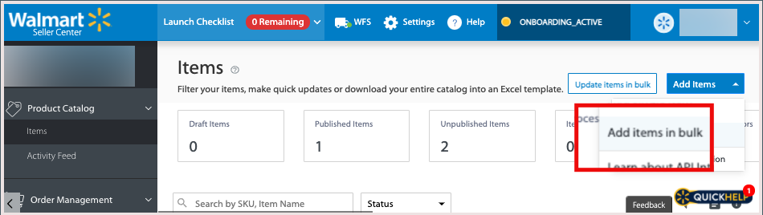

# Conectar Listagens ao Walmart

Como em outros mercados, [!DNL Walmart] permite que vendedores de terceiros listem itens vendidos por outros.

- [!DNL Walmart Marketplace] O usa identificadores de produtos, como UPC e GTIN, para corresponder produtos aos existentes [!DNL Walmart Marketplace] listagens.

- Para produtos correspondentes, a lista do Walmart Marketplace é atualizada para incluir a [!DNL Commerce] oferta do produto ao conectar um produto do [!DNL Channel Manager].

- Normalmente, as ofertas de produtos com os preços mais baixos aparecem primeiro no [!DNL Walmart Marketplace] listagem, mas outros fatores como revisões também afetam a inserção.

## Combinar produtos

Quando você faz a correspondência de produtos, o Gerenciador de canal envia os dados do produto para o [!DNL Walmart Marketplace] para procurar listagens existentes com valores de atributo que correspondam aos valores [!DNL Commerce] atributo de produto. Os critérios de correspondência são determinados pelo [configuração de mapeamento de atributo](map-catalog-attributes.md) para o canal da sua loja.

Se uma correspondência for encontrada, a lista de produtos existente será atualizada para adicionar sua oferta.

### Pré-requisitos

Antes de corresponder produtos, verifique se os valores do atributo de catálogo de produtos atendem aos requisitos do Walmart e defina as configurações do atributo do produto. Consulte [Mapear atributos do catálogo](map-catalog-attributes.md).

#### Selecionar e corresponder produtos

1. Abra um canal de vendas conectado.

1. De **[!UICONTROL Listings]**, selecione os produtos para correspondência que estão em *[!UICONTROL Draft]* status.

   {width="500" zoomable="yes"}

1. Selecionar **[!UICONTROL Match Products]**.

   Uma mensagem indica o número de produtos enviados para correspondência.

   O status dos produtos selecionados muda para [!UICONTROL *Processando*] até que a operação de correspondência seja concluída. Pode levar até 30 minutos para que o Walmart Marketplace conclua a operação de correspondência.

### Verificar status de correspondência

Após a conclusão da correspondência, selecione o **[!UICONTROL Refresh products]** para visualizar o status atual do produto. *Corresponder* ou *Erro*.

- **[!UICONTROL Match]** indica que o produto foi correspondido com êxito. Sua oferta de produto foi conectada a uma lista existente do Walmart Marketplace. Se a variável [O armazenamento do Marketplace não está ativo](walmart-requirements.md#walmart-marketplace-store-status), *[!UICONTROL Staged for Match]* é exibido na *[!UICONTROL Status detail]* coluna. Os produtos preparados são conectados automaticamente quando a variável [!DNL Walmart Marketplace] o armazenamento está ativado.

- **[!UICONTROL Error]** indica que a operação de correspondência falhou devido a um dos seguintes problemas:

   - [!DNL Channel Manager] não foi possível enviar para correspondência devido a um problema de conexão.

   - Nenhuma correspondência foi encontrada.

   - Correspondência encontrada, mas a listagem não pode ser conectada porque [!DNL Walmart Marketplace] retornou um código de erro. Consulte a **[!UICONTROL Error Description]** para obter informações sobre o problema.

### Verificar listagem no Walmart

Depois de corresponder os produtos, revise a lista de produtos atualizada e verifique os detalhes do produto, o preço e a quantidade no estoque no [[!UICONTROL Walmart Marketplace Seller Account Items] painel](https://seller.walmart.com/items-and-inventory/manage-items) para revisar o produto atualizado.

### Solução de problemas de erros de correspondência de produtos

Se a operação de correspondência de produtos falhar com um erro, a mensagem de erro será exibida no *[!UICONTROL Status detail]* na [!UICONTROL Channel Manager] lista de produtos.

Erros comuns retornados são valores de ID do produto formatados incorretamente ou atributos obrigatórios ausentes.

#### Corrigir valores de ID de produto

| Tipo | Descrição | Exemplo |
|------|--------------------------------------------------------------------------------------------------------------------------------------------------------------------------------|---------------------------------------------|
| UPC | GTIN-12, o número de 12 dígitos, incluindo o dígito de verificação.   Se o UPC tiver menos de 12 dígitos, como o UPC-E, que tem 8 dígitos, adicione zeros finais para atender ao requisito. | Alterar de `45678912345` para `045678912345` |
| GTIN | GTIN-14, o número de 14 dígitos, incluindo o dígito de verificação.   Se o seu GTIN tiver menos de 14 dígitos, adicione zeros à esquerda  para cumprir o requisito. | Alterar `456789123456` para `0045678912345` |
| EAN | GTIN-13, o número de 13 dígitos, incluindo o dígito de verificação.   Se o seu EAN tiver menos de 13 dígitos, adicione  zeros para atender ao requisito. | Alterar de `4567891234` para `0004567891234` |

Para obter detalhes sobre os códigos de erro do Walmart Marketplace, consulte o [Ajuda para Vendedores do Walmart](https://sellerhelp.walmart.com/s/guide?article=000005844).

## Fazer upload de novas listagens de produtos

Para produtos que não possuem correspondência no Walmart Marketplace, use um modelo de Excel da categoria de produto do Walmart para fazer upload de listas de produtos em massa. Você preenche o modelo do Walmart usando os dados do catálogo de produtos exportados do [!DNL Commerce] instância.

Para obter novas listagens de produtos, verifique seu catálogo de produtos para garantir que os produtos que você planeja vender no Walmart Marketplace tenham os atributos necessários para as listagens de produtos do Walmart Marketplace.

**Listagens do Walmart Marketplace - Requisitos de atributo**

| **Atributo** | **Nível de requisito** |
|--------------------------|-----------------------|
| SKU | Obrigatório |
| Nome do produto | Obrigatório |
| Tipo de ID do produto | Obrigatório |
| ID do produto | Obrigatório |
| Marca | Obrigatório |
| Descrição curta | Obrigatório |
| Preço de venda | Obrigatório |
| Descrição do site | Obrigatório |
| URL da imagem principal | Obrigatório |
| Peso da remessa | Obrigatório |
| Principais recursos | Recomendado |
| Número do modelo | Recomendado |
| Nome do fabricante | Recomendado |
| Número de peça do fabricante | Recomendado |
| Tamanho | Recomendado |
| Cor | Recomendado |
| URL da imagem principal | Opcional |
| URL da imagem adicional | Opcional |
| Fabricante | Opcional |

### Pré-requisitos

- Verifique se você atende às [Requisitos do Walmart](walmart-requirements.md).

- No seu [!DNL Commerce] catálogo de produtos, verifique se a configuração do catálogo dos produtos a serem listados no Walmart Marketplace tem todos os atributos necessários e se atende às Diretrizes de Conteúdo do Walmart Marketplace.

- Verifique se o trabalho cron está em execução para concluir a operação de exportação.

   - Para instâncias locais, consulte [Configurar e executar o cron](https://experienceleague.adobe.com/docs/commerce-operations/configuration-guide/cli/configure-cron-jobs.html).

   - Para obter a infraestrutura em nuvem do Adobe, consulte [Configurar trabalhos cron](https://experienceleague.adobe.com/docs/commerce-cloud-service/user-guide/configure/app/properties/crons-property.html).

### Crie o arquivo de dados do produto para fazer upload

1. Do seu [Conta do vendedor do Walmart](https://login.account.wal-mart.com/authorize?responseType=code&amp;clientId=66620dfd-1f3f-479b-8b9c-e11f36c5438b&amp;scope=openId&amp;redirectUri=https://seller.walmart.com/resource/login/sso/torbit&amp;nonce=SX17QLMBKR&amp;state=ZBWWNZXXXM&amp;clientType=seller), faça o download de um modelo de lista de produtos no Walmart Seller Center.

   - Na página Itens do catálogo de produtos, selecione **[!UICONTROL Add Items]**. Em seguida, selecione **[!UICONTROL Add items in bulk]**.

      {width="600" zoomable="yes"}

   - Na página de download, selecione **[!UICONTROL Full Setup]**. Em seguida, selecione uma categoria de item e baixe o modelo de categoria.

      {width="600" zoomable="yes"}

   - Verifique se o modelo inclui os atributos obrigatórios e recomendados para a lista de produtos.

1. No [!DNL Commerce] Administrador, selecione os dados do produto a serem exportados do Adobe [!DNL Commerce] local.

   - Em Admin, selecione [!UICONTROL **Sistema** > Transferência de dados > **Exportar**].

   - No [!UICONTROL Export] página no [!UICONTROL Entity Type] selecione [!UICONTROL **Produtos**].

   - No [!UICONTROL Entity Attributes] configure os critérios de seleção para a exportação de dados do produto.

      Use filtros para selecionar e configurar os valores de atributo que se aplicam às categorias de produto que você vende. Certifique-se de incluir os atributos obrigatórios e recomendados do Walmart. (Consulte [Exportar dados](https://experienceleague.adobe.com/docs/commerce-admin/systems/data-transfer/data-export.html) no Adobe [!DNL Commerce] Guia do usuário para obter instruções detalhadas.)

      Para omitir um atributo da exportação, selecione o [!UICONTROL **Excluir**] no início da linha.

1. Role até o final da tabela de atributos e selecione [!UICONTROL **Continuar**] para iniciar a exportação de dados.

   O arquivo de exportação CSV é processado por meio de uma fila de mensagens usando tarefas cron e salvo na variável `var/export/folder`. (Consulte [Gerenciar filas de mensagens](https://experienceleague.adobe.com/docs/commerce-operations/configuration-guide/message-queues/manage-message-queues.html) no *Guia de configuração*.)

1. Abra o modelo do Excel para a categoria de produto Walmart Marketplace e use os recursos de macro do Excel para unir os dados do produto exportados ao modelo do Excel.

1. Faça upload do arquivo do Excel com os dados do produto exportados.

   - Retorne à página Itens do catálogo de produtos no [Centro de vendas Walmart](https://login.account.wal-mart.com/authorize?responseType=code&amp;clientId=66620dfd-1f3f-479b-8b9c-e11f36c5438b&amp;scope=openId&amp;redirectUri=https://seller.walmart.com/resource/login/sso/torbit&amp;nonce=SX17QLMBKR&amp;state=ZBWWNZXXXM&amp;clientType=seller).

   - Selecionar [!UICONTROL **Adicionar itens** > **Adicionar itens em massa**].
   - Arraste a planilha concluída para a seção Upload.
   - Selecionar [!UICONTROL **Enviar**].
   - Selecione o [!UICONTROL  **Feed de atividades**] para visualizar o progresso.

Para obter instruções completas, consulte [Adicionar itens em massa usando a especificação completa do item](https://sellerhelp.walmart.com/s/guide?article=000007680) no [!DNL *Ajuda para Vendedores do Walmart*].
