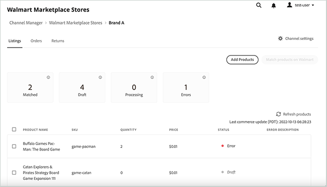

# Gerenciar Listagens

Gerencie listas de produtos para o canal de vendas [!DNL Walmart Marketplace] na interface do usuário do Gerenciador de Canais.

O Status de uma lista individual indica onde o produto está no fluxo de trabalho [!DNL Channel Manager], para que você possa determinar as próximas etapas e resolver erros.

{width="500" zoomable="yes"}

Você pode concluir as seguintes tarefas a partir da exibição Listagem.

* Exibir listagens atuais
* Classificar e filtrar as listagens
* Adicionar produtos
* Combinar produtos
* Rastrear status da lista
* Revisar descrição do erro para listagens com status de erro

## Exibir listagens de produtos

1. No Administrador, vá para [!UICONTROL **Marketing** > **Gerenciador de Canais**].

1. Na lista Loja, selecione o ícone de olho em uma linha de entrada de loja para abrir a visualização de loja.

1. Selecione [!UICONTROL **Listings**].

1. Classifique a exibição *Listagem* selecionando qualquer cabeçalho de coluna na tabela *Listagem*.

1. Filtre a exibição *Listagem* selecionando um dos cartões de contagem de status.

1. Redefina a ordem de classificação e remova filtros selecionando **Atualizar produtos**.

## Adicionar [!DNL Commerce] produtos ao Gerenciador de canal

Crie o sortimento de produtos para o canal [!DNL Walmart Marketplace] concluindo as seguintes tarefas:

* [Adicionar produtos do seu  [!DNL Commerce] catálogo de produtos [!DNL Channel Manager]](add-products-to-channel-store.md)

* [Mapear atributos do catálogo](map-catalog-attributes.md#configure-product-attribute-settings)

## Combinar produtos em [!DNL Walmart]

Você pode criar ofertas de produtos no [!DNL Walmart Marketplace] usando a correspondência de produtos ou carregando manualmente listas de produtos para novos produtos.

* **[Corresponder produtos no Walmart](connect-listings-to-marketplace.md)**—Conecte listas de produtos do seu canal ao [!DNL Walmart Marketplace] atualizando listas existentes que vendem o mesmo produto. Os critérios de correspondência são determinados pela [configuração de mapeamento de atributos](map-catalog-attributes.md) para o seu canal.

* **[Carregar novas listas manualmente](connect-listings-to-marketplace.md#upload-new-product-listings)** — Para produtos que não correspondem a uma lista existente em [!DNL Walmart Marketplace], use um modelo do Excel de categoria de produto [!DNL Walmart] para carregar listas de produtos em massa.

## Listando Controles e Descrições de Coluna

As tabelas a seguir descrevem os controles e colunas disponíveis para [!UICONTROL Listings].

**Controles para[!UICONTROL Listings]**

| **Controle** | **Descrição** |
|----------------------------------------|-------------------------------------------------------------------------------------------------------------------------------------------------------------------------------------------------------------------|
| [!UICONTROL Add Products] | Abre a página [!UICONTROL Admin Product Catalog] para selecionar produtos a serem adicionados ao seu sortimento [!DNL Walmart Marketplace] ou para atualizar os atributos do produto para atender aos requisitos de listagem do Walmart Marketplace. |
| [!UICONTROL Match products on Walmart] | Depois de selecionar um ou mais produtos com o status [!UICONTROL Draft], selecione [!UICONTROL Match products on Walmart] para procurar ofertas de produtos que possam ser adicionadas a uma lista [!DNL Walmart Marketplace] existente. |
| [!UICONTROL Refresh products] | Atualizar a exibição com a lista e o status mais atuais. Esse controle também redefine a exibição de listagem para a ordem de classificação padrão e remove os filtros. |
| [!UICONTROL Filter by *Status*] | Mostre apenas as listagens com um status específico selecionando um dos cartões de status acima da tabela Listagem. Remover o filtro selecionando **[!UICONTROL Refresh products]**. |
| [!UICONTROL Sort products] | Altere a ordem de classificação para a lista selecionando qualquer cabeçalho de coluna. |

**Descrições da coluna**

| **Campo** | **Descrição** |
|--------------------------------|-------------------------------------------------------------------------------------------------------------------------------------------------------------------------------------------------------------------------------------------------------------------------------------------------------------------------------------------------------------------|
| [!UICONTROL Product name] | Nome do produto do catálogo da loja [!DNL Commerce]. |
| [!UICONTROL SKU (Unique ID)] | A SKU atribuída ao produto no catálogo [!DNL Commerce]. |
| [!UICONTROL  Quantity] | Quantidade de inventário disponível no Adobe Commerce ou Magento Open Source. |
| [!UICONTROL Price] | O preço do produto do catálogo da loja [!DNL Commerce]. As atualizações de preço de catálogo são sincronizadas com o Gerenciador de Canais e enviadas para [!DNL Walmart Marketplace] para que os itens listados mostrem o preço atual. |
| [!UICONTROL Status] | Indica o status atual do pedido no fluxo de trabalho do pedido [!DNL Commerce]. O status é atualizado quando você adiciona produtos a [!DNL Channel Manager] com êxito e quando você faz a correspondência de produtos no marketplace. Se uma operação falhar, a lista mostrará um status de erro. Após corrigir o erro, [!DNL Channel Manager] repete a operação e atualiza o status. |
| [!UICONTROL Error Description] | Fornece informações adicionais sobre erros para produtos com status `[!DNL Error]`. |

### Sobre o status da lista

No espaço de trabalho de Listagem, o rótulo Status mostra onde um produto está no fluxo de trabalho [!DNL Channel Manager] para que você possa determinar as próximas etapas e resolver erros. As listagens podem ter os seguintes rótulos de status:

* **[!UICONTROL Draft]**-Identifica os produtos que não foram [enviados para [!DNL Walmart] para correspondência](connect-listings-to-marketplace.md#match-products).

* **[!UICONTROL Processing]** — Identifica produtos enviados para correspondência no [!DNL Walmart Marketplace]. Os produtos permanecem com o status *Processando* até que [!DNL Walmart] retorne uma mensagem de status HTTP que indique se a correspondência foi bem-sucedida ou se houve um erro. Pode levar até 30 minutos para que a operação de correspondência seja concluída no [!DNL Walmart Marketplace].

* **[!UICONTROL Match]**-Identifica produtos que foram correspondidos com êxito em [!DNL Walmart].

  Uma correspondência ocorre quando o valor do atributo do produto — código UPC, por exemplo — corresponde ao valor UPC em uma lista [!DNL Walmart Marketplace] existente. Quando um produto é correspondente, a oferta de produto do Commerce é adicionada à lista existente.

  Verifique o painel [[!UICONTROL Walmart Marketplace Seller Account Items]](https://seller.walmart.com/items-and-inventory/manage-items) para revisar a lista de produtos atualizada e verificar os detalhes do produto, o preço e a quantidade de estoque.

* **[!UICONTROL Match - Match in Stage]** — Identifica produtos correspondentes em [!DNL Walmart] que não podem ser conectados até que o armazenamento [!DNL Walmart Marketplace] esteja ativo. Os produtos com este status são conectados automaticamente quando a loja [!DNL Walmart Marketplace] é ativada.

* **[!UICONTROL Error]** — Identifica produtos que não corresponderam a uma lista [!DNL Walmart Marketplace] existente.

* **[!UICONTROL Error description]** — Fornece informações detalhadas sobre o erro de listagem.

  Após resolver o erro, reenvie o produto para correspondência. Consulte [Solucionar erros de correspondência de produto](connect-listings-to-marketplace.md#troubleshoot-product-match-errors).
